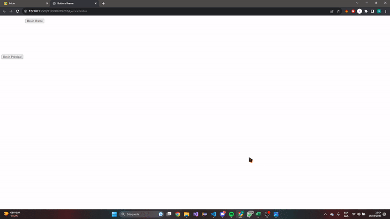

# Boletín de Ejercicios - Sprint 2

 ## ANÁLISIS DEL PROBLEMA 

### Ejercicio 1: Cambio de Color con Botón

- Crear una página web que contenga un botón etiquetado "Cambiar color".
- Al hacer clic en el botón, el color de fondo de la página debe cambiar a un color aleatorio.
- Pista: Utiliza `Math.random()` para generar valores RGB aleatorios.

### Ejercicio 2: Calculadora de Área

- Diseña una página web con dos campos de entrada (input) para introducir el ancho y el alto de un rectángulo.
- Agrega un botón etiquetado "Calcular Área".
- Al hacer clic en el botón, calcula el área del rectángulo y muestra el resultado en un elemento `<p>` en la página.
- Pista: Área del rectángulo = ancho x alto.

### Ejercicio 3: Listado Dinámico

- Crea una página con un campo de entrada y un botón etiquetado "Añadir a la lista".
- También debes tener una lista vacía (`<ul>` o `<ol>`).
- Cuando el usuario escribe algo en el campo de entrada y hace clic en el botón, entonces el contenido del campo debe agregarse como un nuevo ítem (`<li>`) a la lista.
- Pista: Utiliza el método `.createElement()` y `.appendChild()` del DOM.

### Ejercicio 4: Hover y Estilo Dinámico

- Diseña una página con varios elementos div, cada uno con un texto diferente.
- Al pasar el ratón sobre un div, cambia su color de fondo a azul y el texto a blanco.
- Al mover el ratón fuera del div, restaura sus estilos originales.
- Pista: Considera usar eventos como "mouseover" y "mouseout".

### Ejercicio 5: Detección de Clics y Generación de XPath

#### Descripción

Desarrolla una página web que, al hacer clic en cualquier elemento, muestre el XPath único de ese elemento en un cuadro de alerta o en una sección dedicada de la página.

#### Especificaciones

1. **Detección de Clics:**
   - Añade un evento de escucha a todo el documento (`document`) para detectar cualquier clic realizado.
   - Al detectar un clic, determina el elemento exacto que fue clickeado usando el objeto `event.target`.

2. **Generación de XPath:**
   - Una vez identificado el elemento, genera su XPath.
   - Muestra el XPath generado en un cuadro de alerta o en una sección específica de la página.

Se adjunta el HTML para el ejercicio 5 llamado ‘Sprint2Ejercicio5.html’. Hay que hacer clic sobre cada uno de los botones y tiene que venir reflejado que se ha hecho clic sobre cada uno con una alerta que indique el XPATH relativo del que se ha realizado el clic.

## Solucion del Problema 
### Ejercicio 1 
```javascript
document.addEventListener("DOMContentLoaded" , function(){

    const color =  document.getElementById("ColorCambio");

    color.addEventListener("click", function(){

        const Randomcolor = CambiarColor();

        color.style.background = Randomcolor;
    });
    
});

function CambiarColor(){

    const letters = "0123456789ABCDEF";
    let Randomcolor = "#";
    for (let i = 0; i < 6; i++) {
        Randomcolor += letters[Math.floor(Math.random() * 16)];
    }
    return Randomcolor;
}
```
#### Documento HTML
~~~html
<!DOCTYPE html>

<html>
    <head>
        <meta charset="utf-8">
        <meta http-equiv="X-UA-Compatible" content="IE=edge">
        <title>EJERCICIO 1</title>
        <meta name="description" content="">
        <meta name="viewport" content="width=device-width, initial-scale=1">
        <link rel="stylesheet" href="">
        <style>
           button {

            background-color: #007BFF;
            color: white;
            text-align: center;
            position:fixed;
            align-items: center;
            padding: 20px;

           } 
        </style>
    </head>
    <body>
        <div class="container">
         <button id="ColorCambio"> CAMBIAR DE COLOR </button>
        </div>
        <script src="Ejercicio1.js"></script>
    </body>
</html>
~~~
### Ejercicio 2

```javascript 

function calcularArea() {
    var ancho = parseFloat(document.getElementById('ancho').value);
    var alto = parseFloat(document.getElementById('alto').value);
    
    if (isNaN(ancho) || isNaN(alto)) {
        alert('Por favor, ingrese valores numéricos para el ancho y el alto.');
        return;
    }
    
    var area = ancho * alto;
    
    document.getElementById('resultado').innerHTML = 'El área del rectángulo es: ' + area;
}

```
#### Documento HTML
~~~html
<!DOCTYPE html>
<html lang="en">
<head>
    <meta charset="UTF-8">
    <meta name="viewport" content="width=}, initial-scale=1.0">
    <title>Calcular área</title>
    <style>
        body {
            font-family: Arial, sans-serif;
            text-align: center;
        }
        h1 {
            color: #333;
        }
        label {
            display: block;
            margin-top: 10px;
        }
        input {
            width: 80px;
            padding: 5px;
        }
        button {
            margin-top: 3em;
            padding: 10px 20px;
            background-color: #007bff;
            color: #fff;
            border: none;
            cursor: pointer;
        }
        button:hover {
            background-color: #b50401;
        }
        #resultado {
            margin: 20px;
            font-size: 18px;
            color: #333;
        } 
    </style>
</head>
<body>
    <h1>Calculadora de Área de Rectángulo</h1>

    <label for="ancho">Ancho:</label>
    
    <input type="number" id="ancho">
    
    <br>
    <label for="alto">Alto:</label>
    <input type="number" id="alto">
    <br>
    
    <button onclick="calcularArea()">Calcular Área</button>
    
    <p id="resultado"></p>

    <script src="Ejercicio2.js"></script>
    
</body>
</html>
~~~

### Ejercicio 3

```javascript
function agregarALista() {
    var nuevoElemento = document.getElementById('nuevoElemento').value;

    var listItem = document.createElement('li');
    
    listItem.textContent = nuevoElemento;
    

    document.getElementById('miLista').appendChild(listItem);
    
    document.getElementById('nuevoElemento').value = '';
}
```
#### Documento HTML
~~~html
<!DOCTYPE html>
<html lang="en">
<head>
    <meta charset="UTF-8">
    <meta name="viewport" content="width=device-width, initial-scale=1.0">
    <title>Añadir lista</title>
    <style>
        body {
            font-family: Arial, sans-serif;
            text-align: center;
        }

        h1 {
            color: #333;
        }

        label {
            display: block;
            margin-top: 10px;
        }

        input {
            width: 80%;
            padding: 5px;
            margin-bottom: 10px;
        }

        button {
            padding: 10px 20px;
            background-color: #007bff;
            color: #fff;
            border: none;
            cursor: pointer;
        }

        button:hover {
            background-color: #0056b3;
        }

        ul {
            list-style: none;
            padding: 0;
        }

        li {
            font-size: 18px;
            color: #333;
            margin: 5px 0;
            position: relative;
        }
        li:hover{
            color : red
        }
    </style>
</head>
<body>
    <h1>Añadir a la Lista</h1>
    <label for="nuevoElemento">Nuevo Elemento:</label>
    <input type="text" id="nuevoElemento">
    <button onclick="agregarALista()">Añadir a la Lista</button>
    <ul id="miLista"></ul>
    <script src="Ejercicio3.js"></script>
</body>
</html>
~~~

### Ejercicio 4
```javascript
function cambiarEstilos(div) {
    div.style.backgroundColor = '#007bff';
    div.style.color = '#fff';
}

function restaurarEstilos(div) {
    div.style.backgroundColor = '#eee';
    div.style.color = '#000';
}
```
#### Documento HTML
~~~html
<!DOCTYPE html>
<html>
<head>
    <title>Cambio de Estilos al Pasar el Ratón</title>
    <style>
        body {
            font-family: Arial;
            background-image: linear-gradient(
                to bottom right,
                #ff0202 0%,
                #ff9100 20%,
                #fd5400 40%,
                #ffe346 60%,
                #a66805 100%
              );
            
              background-size: 300% 300%;
            
              animation: movimiento 5s linear infinite alternate;
              
            }
            
            @keyframes movimiento {
              from{
                background-position: 0% 0%;
              }
            
              to{
                background-position: 50% 50%;
              }
              
            }
        
        .div-box {
            width: 300px;
            height: 100px;
            display: inline-table ;
            background-color: #eee;
            border: 1px solid #000000;
            margin: 60px;
            padding: 80px;
            text-align: center;
            transition: background-color 0.4s, color 0.4s;
            cursor: pointer;
            margin-right: 5em;
        }

        div{
            font-family: 'Franklin Gothic Medium', 'Arial Narrow', Arial, sans-serif;
        }

        h1 {
            color: rgb(0, 0, 0);
            position: relative;
            text-align: center;
            font-size: 3em;

        }
    </style>
</head>
<body>
    <h1> Cambio de Estilos </h1>
    <div class="div-box" onmouseover="cambiarEstilos(this)" onmouseout="restaurarEstilos(this)">
        Div 1
    </div>
    <div class="div-box" onmouseover="cambiarEstilos(this)" onmouseout="restaurarEstilos(this)">
        Div 2
    </div>
    <div class="div-box" onmouseover="cambiarEstilos(this)" onmouseout="restaurarEstilos(this)">
        Div 3
    </div>
    <div class="div-box" onmouseover="cambiarEstilos(this)" onmouseout="restaurarEstilos(this)">
        Div 4
    </div>
    <script src="Ejercicio4.js"></script>
</body>
</html>
~~~

```javascript
const iframe = document.getElementById('myIframe');

iframe.addEventListener('load', function() {
    const iframeDocument = iframe.contentDocument;

    iframeDocument.addEventListener("click", function(event) {
        const clickedElement = event.target;

        const iframeXPath = getXPath(clickedElement);
        alert("XPath del elemento en el iframe:\n" + iframeXPath);
    });
});

document.addEventListener("DOMContentLoaded", function() {
    document.addEventListener("click", function(event) {
        const clickedElement = event.target;

        const mainXPath = getXPath(clickedElement);

        
        alert("XPath del elemento en la página principal:\n" + mainXPath);
    });
});


function getXPath(element) {
    if (!element) return '';

    const parts = [];
    while (element && element !== document.body) {
        let part = element.localName;
        if (element.id) {
            part += `[@id="${element.id}"]`;
        } else {
            const siblings = element.parentNode ? element.parentNode.children : [];
            if (siblings.length > 1) {
                let count = 0;
                for (let i = 0; i < siblings.length; i++) {
                    const sibling = siblings[i];
                    if (sibling.localName === element.localName) {
                        count++;
                    }
                    if (sibling === element) {
                        part += `[${count + 1}]`;
                        break;
                    }
                }
            }
        }
        parts.unshift(part);
        element = element.parentNode;
    }
    return parts.length ? '/' + parts.join('/') : null;
}

```
#### Documento HTML
~~~html
<!DOCTYPE html>
<html lang="en">
<head>
    <meta charset="UTF-8">
    <meta name="viewport" content="width=device-width, initial-scale=1.0">
    <title>Botón e Iframe</title>
</head>
<body>
    
    <button id="mainButton">Botón Principal</button>
    
    <iframe id="myIframe" width="200" height="200" frameborder="0" srcdoc="<!DOCTYPE html>
        <html lang='en'>
        <head>
            <meta charset='UTF-8'>
            <meta name='viewport' content='width=device-width, initial-scale=1.0'>
            <title>Contenido Iframe</title>
        </head>
        <body>
            <button id='iframeButton'>Botón Iframe</button>
        </body>
        </html>">
    </iframe>
    <script src="Ejercicio5.js"></script>
</body>
</html>
~~~

## Pruebas 

### -> Plan de Pruebas :


### Ejercicio 1 :

### Ejercicio 2 :


### Ejercicio 3 :


### Ejercicio 4 :


### Ejercicio 5 :
