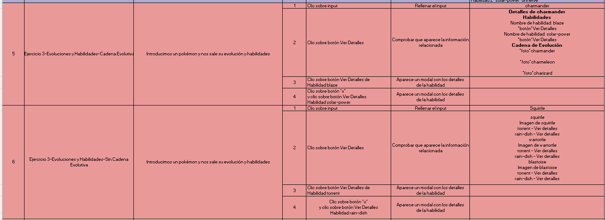

# Boletín de Ejercicios - Sprint 3

 ## ANÁLISIS DEL PROBLEMA 

## Ejercicio 1: Información Básica del Pokémon

- Realizar una petición a la PokeAPI para obtener información básica de un Pokémon por su nombre.
- Mostrar el nombre, id, tipos, y una imagen del Pokémon.
- Gestionar errores de manera adecuada si el Pokémon no existe.
- Dos pruebas, una sin error probando dos búsquedas y otra con error.


## Ejercicio 2: Comparativa de Pokémon

- Obtener datos de dos Pokémon elegidos por el usuario.
- Comparar sus estadísticas base (stats) y determinar cuál de ellos tiene mejores estadísticas generales.
- Presentar los resultados en una tabla comparativa de fácil lectura.
- Dos pruebas sin error.


## Ejercicio 3: Evoluciones y Habilidades

- Dado un Pokémon específico, buscar su cadena de evolución completa.
- Listar cada una de las formas evolutivas y sus habilidades.
- Incluir un botón que permita al usuario ver más detalles de cualquier habilidad (usando un modal o una nueva vista).
- Dos pruebas, una con una cadena evolutiva y otra sin cadena evolutiva.
- Pistas: pokemon/charmander -> pokemon-species/4/ -> evolution-chain/2/

  
## Ejercicio 4: Explorador de Películas

- Objetivo: Crear una aplicación web que permita a los usuarios explorar películas basándose en diferentes criterios como género. Usar la API The Movie DB (TMDB API)
- 
#### Especificaciones

- Interfaz de Búsqueda: Desarrollar una interfaz de usuario donde los usuarios puedan ingresar palabras clave o seleccionar filtros para buscar películas por género.
- Mostrar Resultados: Presentar los resultados de la búsqueda en un formato amigable para el usuario, mostrando detalles como el título de la película, año de lanzamiento, resumen y puntuación.
- Paginación de Resultados: Implementar la paginación para los resultados para que los usuarios puedan navegar a través de múltiples páginas de resultados.
- Dos pruebas, la primera, buscando una película, y en la segunda prueba, aplicar un filtro para que aparezca el reel relleno con paginación. (Estilo Netflix, Amazon Prime Video). Sólo un filtro a la vez.


## Ejercicio 5: Películas favoritas

#### Descripción

- Añadir al ejercicio 4 que se puedan añadir/eliminar las película a una lista de favoritos.

#### Especificaciones

- Prueba 1: Añadir 10 películas a favoritos dándole a la estrellita, comprobar que aparecen las 10 películas seleccionadas.
- Prueba 2: Eliminar la tercera y quinta película (comprobar que ya no aparecen)
- Pruebas 3: Eliminar todas las películas y comprobar que no aparecen.

## Solucion del Problema 

### Ejercicio 1 
```javascript
async function obtenerInfoPokemon() {
    try {
      // Obtener el nombre del Pokémon desde el campo de entrada
      const nombrePokemon = document.getElementById('pokemon').value.trim().toLowerCase();

      if (!nombrePokemon) {
        throw new Error('Por favor, ingresa el nombre de un Pokémon.');
    }
  
      const respuesta = await fetch(`https://pokeapi.co/api/v2/pokemon/${nombrePokemon.toLowerCase()}`);

      
      if (!respuesta.ok) {
        // Verificar si el error es porque el Pokémon no fue encontrado
        if (respuesta.status === 404) {
            throw new Error('No existe ese Pokémon. Ingresa otro nombre.');
        } else {
            throw new Error(`No se pudo obtener información del Pokémon. Código de estado: ${respuesta.status}`);
        }
    }
  
      // Obtener datos del JSON
      const datosPokemon = await respuesta.json();
  
      const contenidoHTML = `
        <h2>${datosPokemon.name}</h2>
        <p>ID: ${datosPokemon.id}</p>
        <p>Tipos: ${datosPokemon.types.map(type => type.type.name).join(', ')}</p>
        
      `;

      const contenedorPokemon = document.getElementById('pokemonInfo');
      contenedorPokemon.innerHTML = contenidoHTML;
    } catch (error) {
      alert(error.message);
  }
  }
```
#### Documento HTML
~~~html
<html lang="en">
<head>
    <meta charset="UTF-8">
    <meta name="viewport" content="width=device-width, initial-scale=1.0">
    <title>Ejercicio 1</title>
</head>
<body>
    <input type="text" id="pokemon" placeholder="Nombre del Pokémon">
    <button onclick="obtenerInfoPokemon()">SEARCH</button>

    <div id="pokemonInfo">
    </div>

    <script src="Ejercicio1.js"></script>
</body>
</html>
~~~
### Ejercicio 2
```javascript
async function compararPokemon() {
    try {
      const nombrePokemon1 = document.getElementById('pokemon1').value;
      const nombrePokemon2 = document.getElementById('pokemon2').value;
  
      const datosPokemon1 = await obtenerDatosPokemon(nombrePokemon1);
      const datosPokemon2 = await obtenerDatosPokemon(nombrePokemon2);

      const tablaHTML = `
        <table border="1">
          <tr>
            <th></th>
            <th>${datosPokemon1.name}</th>
            <th>${datosPokemon2.name}</th>
          </tr>
          <tr>
            <td>ID</td>
            <td>${datosPokemon1.id}</td>
            <td>${datosPokemon2.id}</td>
          </tr>
          <tr>
            <td>HP</td>
            <td>${datosPokemon1.stats[0].base_stat}</td>
            <td>${datosPokemon2.stats[0].base_stat}</td>
          </tr>
          <tr>
            <td>Ataque</td>
            <td>${datosPokemon1.stats[1].base_stat}</td>
            <td>${datosPokemon2.stats[1].base_stat}</td>
          </tr>
          <tr>
            <td>Defensa</td>
            <td>${datosPokemon1.stats[2].base_stat}</td>
            <td>${datosPokemon2.stats[2].base_stat}</td>
          </tr>
          <tr>
            <td></td>
            <td></td>
            <td></td>
          </tr>
          <tr>
          <td>Velocidad</td>
          <td>${datosPokemon1.stats[5].base_stat}</td>
          <td>${datosPokemon2.stats[5].base_stat}</td>
        </tr>
        <tr>
          <td>Habilidad 1</td>
          <td>${datosPokemon1.abilities[0].ability.name}</td>
          <td>${datosPokemon2.abilities[0].ability.name}</td>
        </tr>
        <tr>
          <td>Habilidad 2</td>
          <td>${datosPokemon1.abilities[1] ? datosPokemon1.abilities[1].ability.name : 'N/A'}</td>
          <td>${datosPokemon2.abilities[1] ? datosPokemon2.abilities[1].ability.name : 'N/A'}</td>
        </tr>
      </table>
      <p>${calcularGanador(datosPokemon1, datosPokemon2)}</p>
    `;
  
      const contenedorComparativa = document.getElementById('comparativaInfo');
      contenedorComparativa.innerHTML = tablaHTML;
    } catch (error) {
      console.error(`Error: ${error.message}`);
    }
  }
  

  
function calcularGanador(pokemon1, pokemon2) {
  const statsPokemon1 = pokemon1.stats.reduce((total, stat) => total + stat.base_stat, 0);
  const statsPokemon2 = pokemon2.stats.reduce((total, stat) => total + stat.base_stat, 0);

  if (statsPokemon1 > statsPokemon2) {
      return `${pokemon1.name} es el ganador en estadísticas.`;
  } else if (statsPokemon1 < statsPokemon2) {
      return `${pokemon2.name} es el ganador en estadísticas.`;
  } else {
      return 'Ambos Pokémon tienen estadísticas iguales.';
  }
}

async function obtenerDatosPokemon(nombrePokemon) {
    try {
      const respuesta = await fetch(`https://pokeapi.co/api/v2/pokemon/${nombrePokemon.toLowerCase()}`);
      
      if (!respuesta.ok) {
        throw new Error(`No se pudo obtener información del Pokémon. Código de estado: ${respuesta.status}`);
      }
  
      const datosPokemon = await respuesta.json();
  
      return datosPokemon;
    } catch (error) {
      throw new Error(`Error al obtener datos del Pokémon: ${error.message}`);
    }
  }
  
```

#### Documento HTML
~~~html
<!DOCTYPE html>
<html lang="en">
<head>
    <meta charset="UTF-8">
    <meta name="viewport" content="width=device-width, initial-scale=1.0">
    <title>Ejercicio 2</title>
</head>
<body>
    <label for="pokemon1">Primer Pokémon:</label>
    <input type="text" id="pokemon1" placeholder="Nombre del Pokémon 1">
    
    <label for="pokemon2">Segundo Pokémon:</label>
    <input type="text" id="pokemon2" placeholder="Nombre del Pokémon 2">
    
    <button onclick="compararPokemon()">COMPARE</button>

    <div id="comparativaInfo">
    </div>

    <script src="Ejercicio2.js"></script>
</body>
</html>

~~~

### Ejercicio 3
```javascript
async function fetchEvolutionChain(url) {
    const response = await fetch(url);
    if (!response.ok) {
        throw new Error(`Error al obtener la cadena de evolución: ${response.statusText}`);
    }
    return response.json();
}

async function fetchPokemonDetails(pokemonName) {
    const response = await fetch(`https://pokeapi.co/api/v2/pokemon/${pokemonName}`);
    if (!response.ok) {
        throw new Error(`Error al obtener detalles del Pokémon: ${response.statusText}`);
    }
    return response.json();
}

async function displayEvolutionChain() {
    const pokemonName = document.getElementById('pokemon-input').value.toLowerCase();
    try {
        const speciesResponse = await fetch(`https://pokeapi.co/api/v2/pokemon-species/${pokemonName}`);
        const speciesData = await speciesResponse.json();

        const evolutionData = await fetchEvolutionChain(speciesData.evolution_chain.url);

        let currentStage = evolutionData.chain;
        let htmlContent = '';

        do {
            const pokemonData = await fetchPokemonDetails(currentStage.species.name);

            htmlContent += `<div><h3>${pokemonData.name}</h3>`;
            htmlContent += ``;
            htmlContent += `<ul>`;
            pokemonData.abilities.forEach(ability => {
                htmlContent += `<li>${ability.ability.name} - <button onclick="showAbilityDetails('${ability.ability.url}')">Ver detalles</button></li>`;
            });
            htmlContent += `</ul></div>`;

            currentStage = currentStage.evolves_to[0];
        } while (currentStage);

        document.getElementById('evolutions').innerHTML = htmlContent;

    } catch (error) {
        console.error(error.message);
    }
}

function showAbilityDetails(url) {
    fetch(url)
        .then(response => {
            if (!response.ok) {
                throw new Error(`Error al obtener detalles: ${response.statusText}`);
            }
            return response.json();
        })
        .then(data => {
            document.getElementById('abilityDetails').innerHTML = `Nombre: ${data.name}<br>Descripción: ${data.effect_entries[0].effect}`;
            openModal();
        })
        .catch(error => console.error(error.message));
}

function openModal() {
    document.getElementById('abilityModal').style.display = 'block';
}

function closeModal() {
    document.getElementById('abilityModal').style.display = 'none';
}

document.getElementsByClassName('close')[0].onclick = function() {
    closeModal();
}

window.onclick = function(event) {
    if (event.target == document.getElementById('abilityModal')) {
        closeModal();
    }
}

displayEvolutionChain();

```

#### Documento HTML
~~~html
<!DOCTYPE html>
<html lang="en">
<head>
    <meta charset="UTF-8">
    <meta name="viewport" content="width=device-width, initial-scale=1.0">
    <title>ejercicio3</title>
    <script src="ejercicio3.js" defer></script>
</head>
<body>
    <h2>Evoluciones y Habilidades de Pokémon</h2>
    <div id = "inputtime">
        <input type="text" id="pokemon-input" placeholder="Nombre del Pokémon">
        <button onclick="displayEvolutionChain()">Buscar</button>
    </div>
    <div id="evolutions"></div>

    <div id="abilityModal" class="modal">
        <div class="modal-content">
            <span class="close">&times;</span>
            <p id="abilityDetails"></p>
        </div>
    </div>
</body>
</html>
~~~
### Ejercicio 4
```javascript
const apiKey = '43e61ce0177e66cea4af047e505edb4a'; // Reemplaza con tu propia API key de TMDB
const resultsContainer = document.getElementById('results');
const paginationContainer = document.getElementById('pagination');
let currentPage = 1;

document.addEventListener('DOMContentLoaded', function() {
    ['searchButton', 'nextButton', 'prevButton'].forEach(buttonId => {
        const button = document.getElementById(buttonId);
        if (button) {
            button.addEventListener('click', window[`${buttonId}Event`]);
        }
    });

    // Eventos y carga inicial
    document.getElementById('searchButton').addEventListener('click', searchMoviesEvent);
    document.getElementById('nextButton').addEventListener('click', nextPageEvent);
    document.getElementById('prevButton').addEventListener('click', prevPageEvent);

    if (apiKey) {
        loadGenres();
    }
});

function searchMovies(keyword, page) {
    const url = `https://api.themoviedb.org/3/search/movie?api_key=${apiKey}&language=es-ES&query=${keyword}&page=${page}&include_adult=false`;

    fetch(url)
        .then(response => response.json())
        .then(data => {
            displayResults(data.results);
            displayPagination(data.total_pages, page);
        })
        .catch(error => console.error('Error al buscar películas:', error));
}

function displayResults(movies) {
    resultsContainer.innerHTML = '';
    movies.forEach(movie => {
        const movieElement = createMovieElement(movie);
        resultsContainer.appendChild(movieElement);
    });
}
function nextPage(keyword, genre) {
    if (currentPage < 1000) {
        searchMovies(keyword, genre, currentPage + 1);
    }
}

function prevPage(keyword, genre) {
    if (currentPage > 1) {
        searchMovies(keyword, genre, currentPage - 1);
    }
}

function handlePaginationButtons(totalPages) {
    const nextButton = document.getElementById('nextButton');
    const prevButton = document.getElementById('prevButton');
    prevButton.disabled = currentPage <= 1;
    nextButton.disabled = currentPage >= totalPages;
}

function searchMoviesEvent() {
    const keyword = document.getElementById('keyword').value;
    const genre = document.getElementById('genre').value || '';
    searchMovies(keyword, genre, 1);
}

function nextPageEvent() {
    const keyword = document.getElementById('keyword').value;
    const genre = document.getElementById('genre').value;
    nextPage(keyword, genre);
}

function prevPageEvent() {
    const keyword = document.getElementById('keyword').value;
    const genre = document.getElementById('genre').value;
    prevPage(keyword, genre);
}

function createListEvent(event) {
    event.preventDefault();
    const listName = document.getElementById('listName').value;
    const listDescription = document.getElementById('listDescription').value;
    createList(listName, listDescription);
}


function createMovieElement(movie, action) {
    if (!movie || !movie.id) return null;

    const movieElement = document.createElement('div');
    movieElement.classList.add('movie');
    movieElement.dataset.movieId = movie.id;

    const posterPath = movie.poster_path ? `https://image.tmdb.org/t/p/w500${movie.poster_path}` : 'ruta_a_imagen_por_defecto.jpg';
    movieElement.innerHTML = `
        
        <h3 class="movie-title">${movie.title}</h3>
        <p class="movie-release-date">Año de lanzamiento: ${movie.release_date}</p>
        <p class="movie-overview">${movie.overview}</p>
        <p class="movie-vote-average">Puntuación: ${movie.vote_average}</p>
    `;

    return movieElement;
}

function displayPagination(totalPages, currentPage) {
    paginationContainer.innerHTML = '';

    for (let i = 1; i <= totalPages; i++) {
        const button = document.createElement('button');
        button.classList.add('pagination-button');
        button.textContent = i;

        if (i === currentPage) {
            button.disabled = true;
        } else {
            button.addEventListener('click', function () {
                searchMovies(document.getElementById('keyword').value, i);
            });
        }

        paginationContainer.appendChild(button);
    }
}
async function loadGenres() {
    if (apiKey) {
        try {
            const genreResponse = await fetch(`https://api.themoviedb.org/3/genre/movie/list?api_key=${apiKey}&language=es-ES`);
            const genreData = await genreResponse.json();
            const genreSelect = document.getElementById('genre');
            genreData.genres.forEach(genre => {
                const option = document.createElement('option');
                option.value = genre.id;
                option.textContent = genre.name;
                genreSelect.appendChild(option);
            });
        } catch (error) {
            console.error('Error al cargar géneros:', error);
        }
    } else {
        console.error('API Key no establecida. No se pueden cargar los géneros.');
    }
}

document.getElementById('searchButton').addEventListener('click', function () {
    const keyword = document.getElementById('keyword').value;
    const genre = document.getElementById('genre').value;
    if (keyword || genre) {
        searchMovies(keyword, genre, 1); // Inicia con la primera página
    } else {
        alert('Ingrese una palabra clave o seleccione un género para la búsqueda.');
    }
});

async function searchMovies(keyword, genre, page) {
    try {
        let url = '';
        if (genre) {
            url = `https://api.themoviedb.org/3/discover/movie?api_key=${apiKey}&language=es-ES&sort_by=popularity.desc&include_adult=false&page=${page}&with_genres=${genre}`;
            if (keyword) {
                url += `&query=${keyword}`;
            }
        } else {
            url = `https://api.themoviedb.org/3/search/movie?api_key=${apiKey}&language=es-ES&query=${keyword}&page=${page}&include_adult=false`;
        }

        const response = await fetch(url);
        const data = await response.json();
        currentPage = data.page;
        displayResults(data.results);
        handlePaginationButtons(data.total_pages);
    } catch (error) {
        console.error('Error al buscar películas:', error);
    }
}
```

#### Documento HTML
~~~html
<!DOCTYPE html>
<html lang="es">
<head>
    <meta charset="UTF-8">
    <meta name="viewport" content="width=device-width, initial-scale=1.0">
    <title>Explorador de Películas</title>
</head>
<body>
    <div class="container">
        <h1>Explorador de Películas</h1>
        <div class="search-container">
            <label for="keyword">Palabra clave:</label>
            <input type="text" id="keyword" placeholder="Buscar películas por palabra clave">
            <label for="genre">Género:</label>
            <select id="genre">
                <option value=""> - </option>
            </select>
            <button id="searchButton">Buscar</button>
        </div>
        <div id="results"></div>
        <button id="prevButton">Anterior</button>
        <button id="nextButton">Siguiente</button>
    </div>

    <script src="ejercicio4.js"></script>
</body>
</html>
~~~
### Ejercicio 5
```javascript
let apiKey = localStorage.getItem('tmdbApiKey') || '';
let listId = localStorage.getItem('tmdbListId') || null;
let sessionId = localStorage.getItem('tmdbSessionId') || '';
let currentPage = 1;
let loggedIn = sessionId !== '';

document.addEventListener('DOMContentLoaded', function () {
    ['loginButton', 'setApiKeyButton', 'searchButton', 'nextButton', 'prevButton', 'logoutButton'].forEach(buttonId => {
        const button = document.getElementById(buttonId);
        if (button) {
            button.addEventListener('click', window[`${buttonId}Event`]);
        }
    });

    const createListForm = document.getElementById('createListForm');
    if (createListForm) {
        createListForm.addEventListener('submit', createListEvent);
    }

    // Eventos y carga inicial
    document.getElementById('loginButton').addEventListener('click', authenticateUser);
    document.getElementById('setApiKeyButton').addEventListener('click', setApiKey);
    document.getElementById('searchButton').addEventListener('click', searchMoviesEvent);
    document.getElementById('nextButton').addEventListener('click', nextPageEvent);
    document.getElementById('prevButton').addEventListener('click', prevPageEvent);
    document.getElementById('logoutButton').addEventListener('click', handleLogout);
    document.getElementById('createListForm').addEventListener('submit', createListEvent);
    document.getElementById('recoverListButton').addEventListener('click', function () {
        const listName = prompt('Indica el nombre de tu lista de peliculas:');
        recoverListId(listName);
    });

    if (apiKey) {
        loadGenres();
    }

    if (loggedIn && listId) {
        loadFavorites(); // Cargar favoritos si el usuario está autenticado y listId está disponible
    }
});

document.getElementById('logoutButton').addEventListener('click', handleLogout);

async function createRequestToken() {
    try {
        const response = await fetch(`https://api.themoviedb.org/3/authentication/token/new?api_key=${apiKey}`);
        const data = await response.json();
        return data.request_token;
    } catch (error) {
        console.error('Error al obtener el token de solicitud:', error);
    }
}

// Función para redirigir al usuario para que autorice el token de solicitud
function askUserForPermission(requestToken) {
    const authUrl = `https://www.themoviedb.org/authenticate/${requestToken}?redirect_to=http://127.0.0.1:5500/T1/SPRINT%204/ejercicio5.html`;
    window.location.href = authUrl; // Redirige al usuario para la autorización
}

function handleLogout() {
    sessionId = '';
    listId = null;
    loggedIn = false;
    localStorage.removeItem('tmdbSessionId'); // Elimina la session_id del almacenamiento local
    updateUIForLogout(); // Actualiza la UI para reflejar el estado de logout
}
// Función para crear una ID de sesión (session_id) con el token de solicitud autorizado
async function createSessionId(requestToken) {
    try {
        const response = await fetch(`https://api.themoviedb.org/3/authentication/session/new?api_key=${apiKey}&request_token=${requestToken}`, {
            method: 'POST'
        });
        const data = await response.json();
        if (data.success) {
            sessionId = data.session_id;
            localStorage.setItem('tmdbSessionId', sessionId);
            
            // Añadir el ID de cuenta a localStorage
            localStorage.setItem('tmdbAccountId', data.account_id);

            loggedIn = true;
            updateUIAfterLogin();
            if (listId) {
                await loadFavorites();
            }
        }
    } catch (error) {
        console.error('Error al crear la session_id:', error);
    }
}

function obtenerAccountId() {
    // Asumiendo que durante la creación de la sesión se almacena el ID de cuenta en localStorage
    const accountId = localStorage.getItem('tmdbAccountId');
    
    if (!accountId) {
        console.error('ID de cuenta no encontrado.');
        // Puedes manejar el caso en el que el ID de cuenta no esté disponible
        // Puede ser necesario realizar una solicitud adicional para obtener el ID de cuenta
    }

    return accountId;
}

async function authenticateUser() {
    if (!apiKey) {
        alert('Por favor, establezca primero el API Key.');
        return;
    } else {
        try {
            const requestToken = await createRequestToken();
            if (requestToken) {
                askUserForPermission(requestToken);
            }
        } catch (error) {
            console.error('Error durante la autenticación:', error);
        }
    }
}

// Función para manejar la carga de la página de redirección
async function handleRedirect() {
    const urlParams = new URLSearchParams(window.location.search);
    const requestToken = urlParams.get('request_token');
    const denied = urlParams.get('denied'); // Agrega esto para verificar si el usuario rechazó el consentimiento

    if (requestToken && !denied) {
        await createSessionId(requestToken);
    } else if (denied) {
        // Manejar la situación cuando el usuario rechaza el consentimiento
        handleLogout();
    }
}

window.onload = async function() {
    apiKey = localStorage.getItem('tmdbApiKey') || '';
    sessionId = localStorage.getItem('tmdbSessionId') || '';
    listId = localStorage.getItem('tmdbListId') || null;

    console.log('API Key:', apiKey, 'Session ID:', sessionId, 'List ID:', listId);

    if (!apiKey) {
        console.log('API Key no establecida.');
        return;
    }

    loggedIn = sessionId !== '';

    if (loggedIn) {
        updateUIAfterLogin();
        if (listId) {
            console.log('Cargando favoritos...');
            await loadFavorites();
        }
    } else {
        updateUIForLogout();
        handleRedirect();
    }
};


document.getElementById('createListForm').addEventListener('submit', function(event) {
    event.preventDefault(); // Previene el envío normal del formulario

    // Obtiene los valores del formulario
    const listName = document.getElementById('listName').value;
    const listDescription = document.getElementById('listDescription').value;

    // Llama a la función para crear la lista (debes tener esta función en tu archivo JavaScript)
    createList(listName, listDescription);
});

async function loadGenres() {
    if (apiKey) {
        try {
            const genreResponse = await fetch(`https://api.themoviedb.org/3/genre/movie/list?api_key=${apiKey}&language=es-ES`);
            const genreData = await genreResponse.json();
            const genreSelect = document.getElementById('genre');
            genreData.genres.forEach(genre => {
                const option = document.createElement('option');
                option.value = genre.id;
                option.textContent = genre.name;
                genreSelect.appendChild(option);
            });
        } catch (error) {
            console.error('Error al cargar géneros:', error);
        }
    } else {
        console.error('API Key no establecida. No se pueden cargar los géneros.');
    }
}

async function searchMovies(keyword, genre, page) {
    try {
        let url = '';
        if (genre) {
            url = `https://api.themoviedb.org/3/discover/movie?api_key=${apiKey}&language=es-ES&sort_by=popularity.desc&include_adult=false&page=${page}&with_genres=${genre}`;
            if (keyword) {
                url += `&query=${keyword}`;
            }
        } else {
            url = `https://api.themoviedb.org/3/search/movie?api_key=${apiKey}&language=es-ES&query=${keyword}&page=${page}&include_adult=false`;
        }

        const response = await fetch(url);
        const data = await response.json();
        currentPage = data.page;
        displayResults(data.results);
        handlePaginationButtons(data.total_pages);
    } catch (error) {
        console.error('Error al buscar películas:', error);
    }
}

function displayResults(movies) {
    const resultsDiv = document.getElementById('results');
    resultsDiv.innerHTML = '';
    movies.forEach(movie => {
        const movieElement = createMovieElement(movie, 'add');
        resultsDiv.appendChild(movieElement);
    });
}

function nextPage(keyword, genre) {
    if (currentPage < 1000) {
        searchMovies(keyword, genre, currentPage + 1);
    }
}

function prevPage(keyword, genre) {
    if (currentPage > 1) {
        searchMovies(keyword, genre, currentPage - 1);
    }
}

function handlePaginationButtons(totalPages) {
    const nextButton = document.getElementById('nextButton');
    const prevButton = document.getElementById('prevButton');
    prevButton.disabled = currentPage <= 1;
    nextButton.disabled = currentPage >= totalPages;
}

document.getElementById('recoverListButton').addEventListener('click', function () {
    const listName = prompt('Indica el nombre de tu lista de peliculas:');
    recoverListId(listName);
});

async function recoverListId(listName) {
    if (!sessionId) {
        console.error('Usuario no autenticado. No se puede recuperar la lista.');
        return;
    }

    // Reemplaza {account_id} con el ID de cuenta real del usuario
    const accountId = obtenerAccountId(); // Debes implementar esta función
    const url = `https://api.themoviedb.org/3/account/${accountId}/lists?api_key=${apiKey}&session_id=${sessionId}`;
    try {
        const response = await fetch(url);
        const data = await response.json();
        const list = data.results.find(l => l.name === listName);
        if (list) {
            listId = list.id;
            localStorage.setItem('tmdbListId', listId);
            console.log('Lista cargada');
            await loadFavorites();
        } else {
            console.error('Lista no encontrada.');
        }
    } catch (error) {
        console.error('Error al recuperar listas:', error);
    }
}

async function createList(name, description) {
    if (!sessionId) {
        console.error('Usuario no autenticado.');
        return;
    }

    const url = `https://api.themoviedb.org/3/list?api_key=${apiKey}&session_id=${sessionId}`;
    try {
        const response = await fetch(url, {
            method: 'POST',
            headers: {
                'Content-Type': 'application/json;charset=utf-8'
            },
            body: JSON.stringify({
                name: name,
                description: description,
                language: "es-ES"
            })
        });
        const data = await response.json();
        if (data.success) {
            listId = data.list_id;
            localStorage.setItem('tmdbListId', listId);
            console.log('Lista creada con éxito, listId:', listId);
            // Aquí puedes realizar acciones adicionales, como actualizar la UI.
        } else {
            console.error('Error al crear la lista:', data.status_message);
        }
    } catch (error) {
        console.error('Error al crear la lista:', error);
    }
}


async function createListEvent(event) {
    event.preventDefault();

    if (!loggedIn) {
        console.error('User not authenticated. Please log in first.');
        return;
    }

    const listName = document.getElementById('listName').value;
    const listDescription = document.getElementById('listDescription').value;
    
    createList(listName, listDescription);
    
}

async function addMovieToList(movieId) {
    if (!listId || !loggedIn) {
        console.error('No list of favorites set or user not authenticated.');
        return;
    }

    const url = `https://api.themoviedb.org/3/list/${listId}/add_item?api_key=${apiKey}&session_id=${sessionId}`;

    try {
        const response = await fetch(url, {
            method: 'POST',
            headers: {
                'Content-Type': 'application/json;charset=utf-8'
            },
            body: JSON.stringify({ media_id: movieId })
        });
        const data = await response.json();
        if (data.success) {
            console.log('Movie added to favorites:', movieId);
            // Actualizar la lista de favoritos después de la adición
            await loadFavorites();
        } else {
            console.error('Error adding movie to favorites:', data.status_message);
        }
    } catch (error) {
        console.error('Error adding movie to favorites:', error);
    }
}

async function removeMovieFromList(movieId) {
    if (!listId || !loggedIn) {
        console.error('No list of favorites set or user not authenticated.');
        return;
    }

    const url = `https://api.themoviedb.org/3/list/${listId}/remove_item?api_key=${apiKey}&session_id=${sessionId}`;

    try {
        const response = await fetch(url, {
            method: 'POST',
            headers: {
                'Content-Type': 'application/json;charset=utf-8'
            },
            body: JSON.stringify({ media_id: movieId })
        });
        const data = await response.json();
        if (data.success) {
            console.log('Movie removed from favorites:', movieId);
            // Actualizar la lista de favoritos después de la eliminación
            await loadFavorites();
        } else {
            console.error('Error removing movie from favorites:', data.status_message);
        }
    } catch (error) {
        console.error('Error removing movie from favorites:', error);
    }
}


async function loadFavorites() {
    if (!listId || !loggedIn) {
        console.log('No list of favorites set or user not authenticated.');
        return;
    }

    console.log('Loading movies from favorites list:', listId);

    try {
        const timestamp = new Date().getTime();
        const response = await fetch(`https://api.themoviedb.org/3/list/${listId}?api_key=${apiKey}&language=es-ES&${timestamp}`);
        if (!response.ok) {
            throw new Error(`HTTP error! status: ${response.status}`);
        }
        const data = await response.json();

        console.log('Received movies:', data.items);

        const favoritesDiv = document.getElementById('favorite-results');
        favoritesDiv.innerHTML = '';

        data.items.forEach(movie => {
            const movieElement = createMovieElement(movie, 'remove');
            if (movieElement) {
                favoritesDiv.appendChild(movieElement);
            }
        });
    } catch (error) {
        console.error('Error loading favorites from API:', error);
    }
}

function updateUIForLogout() {
    document.getElementById('createListSection').style.display = 'none';
    document.getElementById('favoritesFieldset').style.display = 'none';
    document.getElementById('logoutButton').style.display = 'none';
    document.getElementById('recoverListButton').style.display = 'none';
    document.getElementById('loginButton').style.display = 'block';

    // Limpiar cualquier dato relacionado con la sesión
    listId = null;
    localStorage.removeItem('tmdbListId');
}

function createMovieElement(movie, action) {
    if (!movie || !movie.id) return null;

    const movieElement = document.createElement('div');
    movieElement.classList.add('movie');
    movieElement.dataset.movieId = movie.id;

    const posterPath = movie.poster_path ? `https://image.tmdb.org/t/p/w500${movie.poster_path}` : 'ruta_a_imagen_por_defecto.jpg';
    movieElement.innerHTML = `
        
        <h3 class="movie-title">${movie.title}</h3>
        <p class="movie-release-date">Año de lanzamiento: ${movie.release_date}</p>
        <p class="movie-overview">${movie.overview}</p>
        <p class="movie-vote-average">Puntuación: ${movie.vote_average}</p>
        <button class='favorite-button'>${action === 'add' ? 'Agregar a Favoritos' : 'Eliminar de Favoritos'}</button>
    `;

    const favoriteButton = movieElement.querySelector('.favorite-button');
    favoriteButton.addEventListener('click', async () => {
        if (action === 'remove') {
            await removeMovieFromList(movie.id);
        } else if (action === 'add') {
            await addMovieToList(movie.id);
        }
    });

    return movieElement;
}

// Nuevo botón para cerrar sesión
document.getElementById('logoutButton').addEventListener('click', function() {
    sessionId = '';
    listId = null;
    loggedIn = false;
    updateUIForLogout(); // Función para actualizar la UI después del logout
});

// Función para actualizar la UI después de cerrar sesión
function updateUIForLogout() {
    document.getElementById('createListSection').style.display = 'none';
    document.getElementById('favoritesFieldset').style.display = 'none';
    document.getElementById('logoutButton').style.display = 'none';
    document.getElementById('recoverListButton').style.display = 'none';
    document.getElementById('loginButton').style.display = 'block';
    // Limpia cualquier dato relacionado con la sesión
    // Por ejemplo: Limpiar la lista de favoritos
}

// Función para actualizar la UI después de iniciar sesión
function updateUIAfterLogin() {
    if (loggedIn) {
        document.getElementById('createListSection').style.display = 'block';
        document.getElementById('favoritesFieldset').style.display = 'block';
        document.getElementById('logoutButton').style.display = 'block';
        document.getElementById('recoverListButton').style.display = 'block';
        document.getElementById('loginButton').style.display = 'none';
        loadFavorites();
    }
}

// Función para pedir la API Key al usuario
function askForApiKey() {
    const userApiKey = prompt("Por favor, introduce tu API Key:");
    if (userApiKey) {
        apiKey = userApiKey;
    } else {
        alert("Se requiere una API Key para utilizar esta aplicación.");
    }
}

// Funciones Auxiliares
function setApiKey() {
    const userApiKey = prompt('Por favor, ingresa tu API Key:');
    if (userApiKey) {
        apiKey = userApiKey;
        localStorage.setItem('tmdbApiKey', apiKey);
        console.log('API Key establecida:', apiKey);
        loadGenres();
    } else {
        alert("Se requiere una API Key para utilizar esta aplicación.");
    }
}

function searchMoviesEvent() {
    const keyword = document.getElementById('keyword').value;
    const genre = document.getElementById('genre').value || '';
    searchMovies(keyword, genre, 1);
}

function nextPageEvent() {
    const keyword = document.getElementById('keyword').value;
    const genre = document.getElementById('genre').value;
    nextPage(keyword, genre);
}

function prevPageEvent() {
    const keyword = document.getElementById('keyword').value;
    const genre = document.getElementById('genre').value;
    prevPage(keyword, genre);
}

function createListEvent(event) {
    event.preventDefault();
    const listName = document.getElementById('listName').value;
    const listDescription = document.getElementById('listDescription').value;
    createList(listName, listDescription);
}

// Agregar un botón y su funcionalidad para pedir la API Key
document.getElementById('apiKeyButton').addEventListener('click', askForApiKey);

// Función para agregar una película a la lista de favoritos y actualizar la UI
async function addMovieToList(movieId) {
    if (!listId || !loggedIn) {
        console.error('No hay una lista de favoritos establecida o el usuario no está autenticado.');
        return;
    }

    const url = `https://api.themoviedb.org/3/list/${listId}/add_item?api_key=${apiKey}&session_id=${sessionId}`;
    try {
        const response = await fetch(url, {
            method: 'POST',
            headers: {
                'Content-Type': 'application/json;charset=utf-8'
            },
            body: JSON.stringify({ media_id: movieId })
        });
        const data = await response.json();
        if (data.success) {
            console.log('Película añadida a la lista de favoritos:', movieId);
            // Obtener la información de la película y agregarla visualmente
            const movieResponse = await fetch(`https://api.themoviedb.org/3/movie/${movieId}?api_key=${apiKey}&language=es-ES`);
            const movieData = await movieResponse.json();
            const movieElement = createMovieElement(movieData, 'remove');
            if (movieElement) {
                document.getElementById('favorite-results').appendChild(movieElement);
            }
        } else {
            console.error('Error al añadir la película a la lista:', data.status_message);
        }
    } catch (error) {
        console.error('Error al añadir la película a la lista:', error);
    }
}


```

#### Documento HTML
~~~html
<!DOCTYPE html>
<html lang="en">
<head>
    <meta charset="UTF-8">
    <meta name="viewport" content="width=device-width, initial-scale=1.0">
    <title>MOVIX</title>
    <link rel="stylesheet" href="styles.css">
    <script src="ejercicio5.js" defer></script>
</head>
<body>
    <header>
        <h1>MOVIX</h1>
    </header>

    <nav>
        <a href="https://www.themoviedb.org/settings/api" target="_blank">Consultar API Key</a>
        <button id="setApiKeyButton">Establecer API Key</button>
        <button id="loginButton">CONEXION A  TMDB</button>
        <button id="logoutButton" style="display: none;">Cerrar Sesión</button>
        <button id="recoverListButton" style="display: none;">Recuperar Lista</button>
    </nav>

    <fieldset style="display: none;" id="createListSection">
        <legend>Crear Lista de Peliculas Favoritas</legend>
        <form id="createListForm">
            <label for="listName">Nombre de la Lista:</label>
            <input type="text" id="listName" name="listName" required><br><br>

            <label for="listDescription">Descripción de la Lista:</label>
            <textarea id="listDescription" name="listDescription" required></textarea><br><br>

            <button type="submit">Crear Lista</button>
        </form>
    </fieldset>

    <fieldset>
        <legend>Buscar Películas</legend>
        <label for="keyword">Título:</label>
        <input type="text" id="keyword" name="keyword">
        
        <label for="genre">Género:</label>
        <select id="genre" name="genre">
            <option value="">x</option>
            <!-- Las opciones de género se cargarán desde la API -->
        </select>
        
        <button id="searchButton">Buscar</button>
    </fieldset>

    <fieldset id="favoritesFieldset" style="display: none;">
        <legend>Favoritas</legend>
        <div id="favorite-results">
            <!-- Los resultados de los favoritos se mostrarán aquí -->
        </div>
    </fieldset>

    <fieldset>
        <legend>Peliculas encontradas</legend>
        <div id="results">
            <!-- Los resultados de la búsqueda se mostrarán aquí -->
        </div>
        <button id="prevButton">Anterior</button>
        <button id="nextButton">Siguiente</button>
    </fieldset>
    <footer>
        <p>&copy; 2023 MOVIX.INC</p>
    </footer>
</body>
</html>
~~~
## Pruebas 

### -> Plan de Pruebas :





- Ejercicio 5


### Ejercicio 1 :

### Ejercicio 2 :


### Ejercicio 3 :


### Ejercicio 4 :


### Ejercicio 5 :

