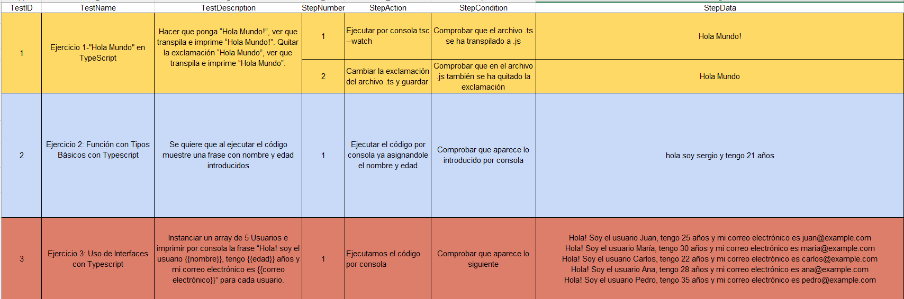
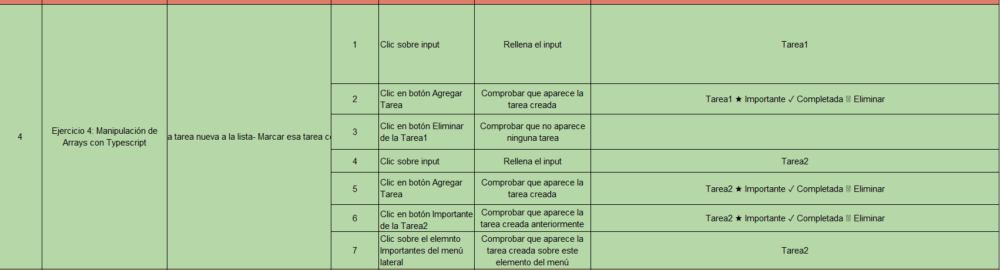
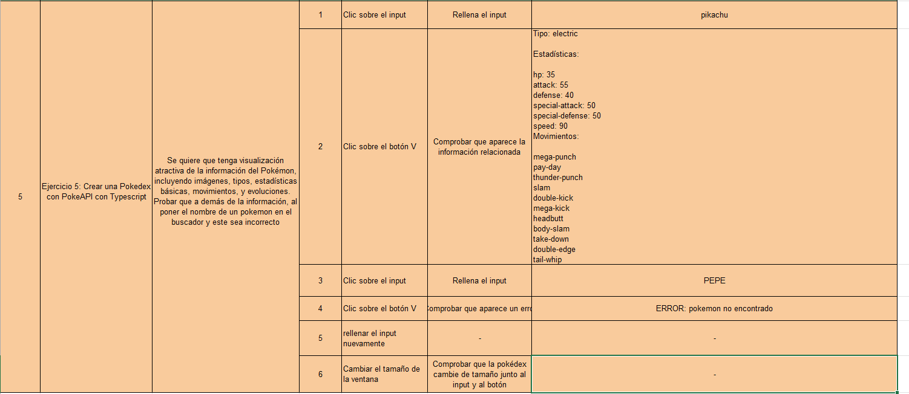
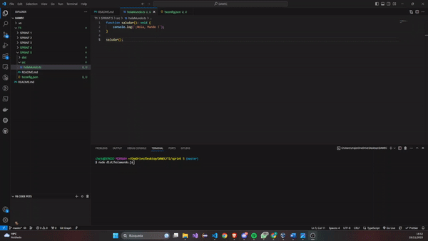
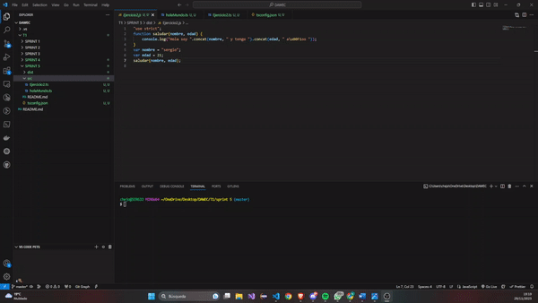
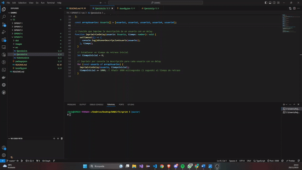
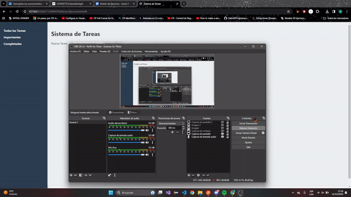
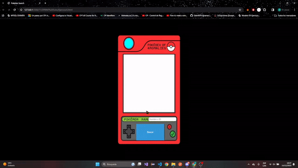

# Boletín de Ejercicios - Sprint 5

 ## ANÁLISIS DEL PROBLEMA 

### Diferencias entre JavaScript y TypeScript

| Característica                | JavaScript                                     | TypeScript                                    |
| ----------------------------- | ---------------------------------------------- | ---------------------------------------------- |
| **Tipado**                    | Dinámico (tipos asignados en tiempo de ejecución) | Estático (tipos asignados en tiempo de desarrollo) |
| **Extensiones de Archivo**    | `.js`                                          | `.ts`                                          |
| **Compilación**               | No requiere compilación explícita              | Requiere compilación a JavaScript mediante el compilador TypeScript (`tsc`) |
| **Interfaces y Tipos**        | No admite interfaces                           | Admite interfaces y tipos para definir estructuras más complejas |
| **Soporte de ES6+**           | Sí, con algunas limitaciones                   | Sí, con un soporte completo                    |
| **Decoradores**               | No soporta                                     

### Configuración de Transpilación Automática con Node.js

#### Para JavaScript:

1. **No es necesario configurar la transpilación explícitamente en JavaScript**, ya que es un lenguaje interpretado y no requiere un paso de compilación como TypeScript.

#### Para TypeScript:

1. **Instala TypeScript globalmente:**
   ```bash
   npm install -g typescript
   ```
2. **Creamos un archivo de configuraciòn tsconfig.json en la raiz del proyecto:**
- Configura tsconfig.json según tus necesidades. 
  Por ejemplo:
   ```json
   {
  "compilerOptions": {
    "target": "es5",
    "outDir": "./dist",
    "rootDir": "./src",
    "strict": true
  }}
  ```

El código mostrado es la configuración del compilador TypeScript en un archivo llamado `tsconfig.json`. Este archivo se utiliza para especificar las opciones de configuración del compilador TypeScript para un proyecto.

Vamos a desglosar cada una de las opciones que has configurado:

- **`target`:** Especifica la versión de ECMAScript a la que se compilará el código TypeScript. En tu caso, estás compilando a ECMAScript 5 (ES5), que es compatible con una amplia gama de navegadores.

- **`outDir`:** Indica el directorio de salida para los archivos JavaScript generados. En tu configuración, los archivos compilados se colocarán en el directorio `dist`.

- **`rootDir`:** Establece el directorio raíz de entrada. Todos los archivos TypeScript a compilar deben estar dentro de este directorio. En tu caso, los archivos fuente se esperan en el directorio `src`.

- **`strict`:** Activa todas las opciones estrictas de TypeScript. Esto incluye opciones como `noImplicitAny`, `strictNullChecks`, etc. Estas opciones ayudan a detectar y prevenir errores comunes durante el desarrollo.

Al tener esta configuración, cuando ejecutas el comando `tsc` en el directorio del proyecto, el compilador TypeScript utiliza el archivo `tsconfig.json` para saber cómo compilar el código fuente TypeScript. Esto es útil para proyectos más grandes y facilita la consistencia en la configuración del compilador entre diferentes desarrolladores y máquinas.


3. **Crea un script en el archivo package.json para transpilar automáticamente:**
```json
   {
  "scripts": {
    "build": "tsc -w"
  }}
  ```

4. **Ejecuta el script de transpilación en segundo plano:**

 ```bash
   npm run build
   ```

## Ejercicio 1: "Hola Mundo" en TypeScript
* Objetivo: Crear un programa simple que imprima "Hola Mundo" en la consola.

- Instalar TypeScript y configurar el entorno de desarrollo.
- Crear un archivo holaMundo.ts.
- Escribir una función que imprima "Hola Mundo".
- Transpilar el archivo TypeScript a JavaScript y ejecutarlo.

#### Especificaciones
- **Hacer que ponga “Hola Mundo!”, ver que transpila e imprime “Hola Mundo!”. Quitar la exclamación “Hola Mundo”, ver que transpila e imprime “Hola Mundo"**

## Ejercicio 2: Función con Tipos Básicos con Typescript

* Objetivo: Escribir una función que acepte un nombre (string) y una edad (number) y devuelva un saludo personalizado.

- Crear una función saludar que tome dos parámetros: nombre y edad.
- La función debe retornar un saludo que incluya ambos datos.
- Probar la función con diferentes nombres y edades.

#### Especificaciones
- **Hacer que se pida introducir un nombre y una edad, tras esto, tendría que salir un texto que indique “Hola! mi nombre es {{nombre}} y tengo {{edad}} años”**


## Ejercicio 3: Uso de Interfaces con Typescript
* Objetivo: Crear una interfaz para un objeto "Usuario" y utilizarla para crear un usuario
- Definir una interfaz Usuario con propiedades como nombre, edad y correo electrónico.
- Crear una función que acepte un objeto Usuario y devuelva una descripción del usuario.
- Crear varios objetos de prueba y pasarlos a la función.

#### Especificaciones
- **Instanciar un array de 5 Usuarios e imprimir por consola la frase “Hola! soy el usuario {{nombre}}, tengo {{edad}} años y mi correo electrónico es {{correo electrónico}}” para cada usuario.**
  
## Ejercicio 4: Manipulación de Arrays con Typescript

* Objetivo: Crear una aplicación simple que maneje una lista de tareas (to-do list) usando arrays en TypeScript. Todo con una vista HTML.
  
- Crear un array para almacenar tareas, cada una siendo un objeto con propiedades como id, titulo, y completada.
- Implementar funciones para añadir, eliminar y marcar tareas como completadas.
- Crear una función que muestre las tareas en la consola.

#### Especificaciones

- Añadir tarea a la lista de tareas
- Borrar tarea de la lista de tareas
- Añadir una tarea nueva a la lista
- Marcar esa tarea como “Importante”
- Ver que aparece en la lista de “Importante” y en la de tareas normal


## Ejercicio 5:  Crear una Pokedex con PokeAPI con Typescript

#### Descripción

* Objetivo: Construir una aplicación en TypeScript que utilice la PokeAPI para mostrar información de Pokémon.

- Estudiar la documentación de la PokeAPI para entender cómo obtener datos de Pokémon.
- Crear una interfaz de usuario interactiva utilizando HTML/CSS.
- Implementar un campo de búsqueda donde los usuarios puedan escribir el nombre o ID de un Pokémon y obtener resultados en tiempo real.
- Diseñar una visualización atractiva de la información del Pokémon, incluyendo imágenes, tipos, estadísticas básicas, movimientos, y evoluciones.
- Manejar posibles errores, como búsquedas de Pokémon que no existen.

#### Especificaciones

**Se tiene una visualización atractiva de la información del Pokémon, incluyendo imágenes, tipos, estadísticas básicas, movimientos, y evoluciones. Probar que a demás de la información, al poner el nombre de un pokemon en el buscador y este sea incorrecto (PEPE), pues aparece una pequeña animación en formato de “warning” de que ese pokemon no existe.**

## Solucion del Problema 

### Ejercicio 1 
```typescript
function Hola(): void {
    console.log(`¡Hola, Mundo !`);
}

Hola();
```
### Ejercicio 2
```typescript
function saludar (nombre : string ,  edad : number){

    console.log(`Hola soy ${nombre} y tengo ${edad} años `);
}

const nombre = "sergio";
const edad = 21;

saludar(nombre, edad);
```

### Ejercicio 3
```typescript
interface Usuario{
    nombre: string;
    edad: number ;
    correoElectronico: string;
}

function obtenerDescripcionUsuario(usuario: Usuario): string {
    return `Hola! Soy el usuario ${usuario.nombre}, tengo ${usuario.edad} años y mi correo electrónico es ${usuario.correoElectronico}`;
  }
const usuario1: Usuario = {
    nombre: "Juan",
    edad: 25,
    correoElectronico: "juan@example.com",
};

const usuario2: Usuario = {
    nombre: "María",
    edad: 30,
    correoElectronico: "maria@example.com",
};

const usuario3: Usuario = {
    nombre: "Carlos",
    edad: 22,
    correoElectronico: "carlos@example.com",
};

const usuario4: Usuario = {
    nombre: "Ana",
    edad: 28,
    correoElectronico: "ana@example.com",
};

const usuario5: Usuario = {
    nombre: "Pedro",
    edad: 35,
    correoElectronico: "pedro@example.com",
};

const arrayUsuarios: Usuario[] = [usuario1, usuario2, usuario3, usuario4, usuario5];


// Función que imprime la descripción de un usuario con un delay
function imprimirConDelay(usuario: Usuario, tiempo: number): void {
    setTimeout(() => {
      console.log(obtenerDescripcionUsuario(usuario));
    }, tiempo);
  }
  
  // Establecer un tiempo de retraso inicial
  let tiempoInicial = 0;
  
  // Imprimir por consola la descripción para cada usuario con un delay
  for (const usuario of arrayUsuarios) {
    imprimirConDelay(usuario, tiempoInicial);
    tiempoInicial += 1000; // Añadir 1000 milisegundos (1 segundo) al tiempo de retraso
  }
```
### Ejercicio 4
```typescript
interface Tarea {
    id: number;
    titulo: string;
    completada: boolean;
    importante: boolean;
  }
  
  // Array para almacenar las tareas
  const listaTareas: Tarea[] = [];
  let tareasImportantes: Tarea[] = []; // Variable global para almacenar tareas importantes
  
  function agregarTareaDesdeInput(): void {
    const tareaInput = document.getElementById('tareaInput') as HTMLInputElement;
    const nuevoTitulo = tareaInput.value;
    if (nuevoTitulo.trim() !== '') {
      agregarTarea(nuevoTitulo);
      tareaInput.value = ''; // Limpiar el input después de agregar la tarea
    } else {
      console.log('El título de la tarea no puede estar vacío.');
    }
  }
  
  function agregarTarea(titulo: string): void {
    const nuevaTarea: Tarea = {
      id: listaTareas.length + 1,
      titulo: titulo,
      completada: false,
      importante: false,
    };
  
    listaTareas.push(nuevaTarea);
    console.log(`Tarea "${titulo}" añadida.`);
    mostrarTodas(); // Actualizar la lista de tareas en el elemento correspondiente
  }
  
  function eliminarTarea(id: number): void {
    const indice = listaTareas.findIndex((tarea) => tarea.id === id);
  
    if (indice !== -1) {
      const tareaEliminada = listaTareas.splice(indice, 1)[0];
      console.log(`Tarea "${tareaEliminada.titulo}" eliminada.`);
  
      // Eliminar la tarea de la lista de tareas importantes
      tareasImportantes = tareasImportantes.filter((tarea) => tarea.id !== id);
  
      mostrarTodas(); // Actualizar la lista de tareas en el elemento correspondiente
    } else {
      console.log(`No se encontró la tarea con ID ${id}.`);
    }
  }
  
  function marcarComoCompletada(id: number): void {
    const tarea = listaTareas.find((t) => t.id === id);
  
    if (tarea) {
      tarea.completada = true;
      console.log(`Tarea "${tarea.titulo}" marcada como completada.`);
      mostrarTodas(); // Actualizar la lista de tareas en el elemento correspondiente
    } else {
      console.log(`No se encontró la tarea con ID ${id}.`);
    }
  }
  
  function marcarComoImportante(id: number): void {
    const tarea = listaTareas.find((t) => t.id === id);
  
    if (tarea) {
      tarea.importante = true;
      console.log(`Tarea "${tarea.titulo}" marcada como importante.`);
      tareasImportantes.push(tarea);
      mostrarTodas(); // Actualizar la lista de tareas en el elemento correspondiente
    } else {
      console.log(`No se encontró la tarea con ID ${id}.`);
    }
  }
  
  function mostrarTodas(): void {
    const listaTareasElemento = document.getElementById('listaTareas');
    const tareaInputElemento = document.getElementById('sistemaTareas');
  
    if (listaTareasElemento && tareaInputElemento) {
      listaTareasElemento.innerHTML = '';
      tareaInputElemento.innerHTML = `<h1>Sistema de Tareas</h1>
        <label for="tareaInput">Nueva Tarea:</label>
        <input type="text" id="tareaInput" placeholder="Escribe tu nueva tarea">
        <button onclick="agregarTareaDesdeInput()">Agregar Tarea</button>`;
  
      listaTareas.forEach((tarea) => {
        const tareaElemento = document.createElement('li');
        tareaElemento.innerHTML = `
          <span>${tarea.titulo}</span>
          <button onclick="marcarComoImportante(${tarea.id})">&#x2605; Importante</button>
          <button onclick="marcarComoCompletada(${tarea.id})">&#10003; Completada</button>
          <button onclick="eliminarTarea(${tarea.id})">&#x1F5D1; Eliminar</button>
        `;
        if (tarea.completada) {
          tareaElemento.classList.add('completed');
        }
        listaTareasElemento.appendChild(tareaElemento);
      });
    }
  }
  
  function mostrarImportantes(): void {
    const listaTareasElemento = document.getElementById('listaTareas');
    const tareaInputElemento = document.getElementById('sistemaTareas');
    const h1Importantes = document.createElement('h1');
    h1Importantes.textContent = 'Importantes';
  
    if (listaTareasElemento && tareaInputElemento) {
      listaTareasElemento.innerHTML = '';
      tareaInputElemento.innerHTML = '';
      tareaInputElemento.appendChild(h1Importantes);
  
      tareasImportantes.forEach((tarea) => {
        const tareaElemento = document.createElement('li');
        tareaElemento.textContent = `${tarea.titulo}`;
        listaTareasElemento.appendChild(tareaElemento);
      });
    }
  }
  
  function mostrarCompletadas(): void {
    const listaTareasElemento = document.getElementById('listaTareas');
    const tareaInputElemento = document.getElementById('sistemaTareas');
    const h1Completadas = document.createElement('h1');
    h1Completadas.textContent = 'Completadas';
  
    if (listaTareasElemento && tareaInputElemento) {
      listaTareasElemento.innerHTML = '';
      tareaInputElemento.innerHTML = '';
      tareaInputElemento.appendChild(h1Completadas);
  
      const completadas = listaTareas.filter((tarea) => tarea.completada);
  
      completadas.forEach((tarea) => {
        const tareaElemento = document.createElement('li');
        tareaElemento.innerHTML = `
          <span>${tarea.titulo}</span>
        `;
        tareaElemento.classList.add('completed');
        listaTareasElemento.appendChild(tareaElemento);
      });
    }
  }
  
  function mostrarImportantesDesdeMenu(): void {
    mostrarImportantes();
  }
  
  function borrarTarea(id: number): void {
    eliminarTarea(id);
    mostrarTodas();
  }
  
  function marcarImportante(id: number): void {
    marcarComoImportante(id);
    mostrarTodas();
  }

  function mostrarTareasEnConsola(): void {
    console.log('Lista de Tareas:');
    listaTareas.forEach((tarea) => {
      console.log(`ID: ${tarea.id}, Título: ${tarea.titulo}, Completada: ${tarea.completada ? 'Sí' : 'No'}, Importante: ${tarea.importante ? 'Sí' : 'No'}`);
    });
  
    console.log('Lista de Tareas Importantes:');
    tareasImportantes.forEach((tarea) => {
      console.log(`ID: ${tarea.id}, Título: ${tarea.titulo}, Completada: ${tarea.completada ? 'Sí' : 'No'}, Importante: ${tarea.importante ? 'Sí' : 'No'}`);
    });
  }
  
  // Llamas a la función cuando sea necesario
  mostrarTareasEnConsola();
  
```
#### Documento HTML
~~~html
<!DOCTYPE html>
<html lang="es">
<head>
  <meta charset="UTF-8">
  <meta name="viewport" content="width=device-width, initial-scale=1.0">
  <title>Sistema de Tareas</title>
  <link rel="stylesheet" href="Eje4.css">
</head>
<body>

<div id="app">
  <div class="sidebar">
    <ul>
      <li><a href="#" onclick="mostrarTodas()">Todas las Tareas</a></li>
      <li><a href="#" onclick="mostrarImportantes()">Importantes</a></li>
      <li><a href="#" onclick="mostrarCompletadas()">Completadas</a></li>
    </ul>
  </div>

  <div class="content">
    <div id="sistemaTareas">
      <h1>Sistema de Tareas</h1>
      <label for="tareaInput">Nueva Tarea:</label>
      <input type="text" id="tareaInput" placeholder="Escribe tu nueva tarea">
      <button onclick="agregarTareaDesdeInput()">Agregar Tarea</button>
    </div>

    <ul id="listaTareas">
      <!-- Las tareas se mostrarán aquí dinámicamente -->
    </ul>
  </div>
</div>

<script src="dist/Ejercicio4.js"></script>
</body>
</html>

~~~
### Ejercicio 5
```typescript
// main.ts

interface Pokemon {
  name: string;
  id: number;
  sprites: {
      front_default: string;
  };
  types: {
      type: {
          name: string;
      };
  }[];
  stats: {
      base_stat: number;
      stat: {
          name: string;
      };
  }[];
  moves: {
      move: {
          name: string;
      };
  }[];
  species: {
      name: string;
      url: string;
  };
}

async function buscarPokemon() {
  const inputElement = document.getElementById('pokemonInput') as HTMLInputElement;
  const pokemonNameOrId = inputElement.value.toLowerCase();

  try {
      const response = await fetch(`https://pokeapi.co/api/v2/pokemon/${pokemonNameOrId}`);
      const data: Pokemon = await response.json();

      mostrarInfoPokemon(data);
  } catch (error) {
      console.error('Error al buscar Pokémon:', error);
      mostrarError();
  }
}


async function mostrarInfoPokemon(data: Pokemon) {
  const pokemonInfoElement = document.getElementById('pokemonInfo');

  if (!pokemonInfoElement) {
      console.error('Elemento de información del Pokémon no encontrado.');
      return;
  }

  const evolutionInfoElement = document.createElement('div');
  evolutionInfoElement.id = 'evolutionInfo';

  pokemonInfoElement.innerHTML = `
      <h2>${data.name} (ID: ${data.id})</h2>
      
      <p><strong>Tipo:</strong> ${data.types.map(type => type.type.name).join(', ')}</p>
      <p><strong>Estadísticas:</strong></p>
      <ul>
          ${data.stats.map(stat => `<li>${stat.stat.name}: ${stat.base_stat}</li>`).join('')}
      </ul>
      <p><strong>Movimientos:</strong></p>
      <ul>
          ${data.moves.map(move => `<li>${move.move.name}</li>`).join('')}
      </ul>
      <p><strong>Evoluciones:</strong></p>
  `;

  pokemonInfoElement.appendChild(evolutionInfoElement);

  try {
      const speciesResponse = await fetch(data.species.url);
      const speciesData = await speciesResponse.json();
      const evolutionChainUrl = speciesData.evolution_chain.url;

      if (evolutionChainUrl) {
          const evolutionResponse = await fetch(evolutionChainUrl);
          const evolutionData = await evolutionResponse.json();
          mostrarInfoEvoluciones(evolutionData, evolutionInfoElement);
      }
  } catch (error) {
      console.error('Error al obtener información de evoluciones:', error);
      mostrarError();
  }

  pokemonInfoElement.classList.remove('hidden');
}

function mostrarInfoEvoluciones(evolutionData: any, evolutionInfoElement: HTMLElement) {
  if (!evolutionInfoElement) {
      console.error('Elemento de información de evoluciones no encontrado.');
      return;
  }

  function mostrarEvolucionesRecursivo(chain: any) {
      evolutionInfoElement.innerHTML += `
          <p>${chain.species.name}</p>
      `;

      if (chain.evolves_to && chain.evolves_to.length > 0) {
          evolutionInfoElement.innerHTML += '<ul>';
          for (const evolution of chain.evolves_to) {
              mostrarEvolucionesRecursivo(evolution);
          }
          evolutionInfoElement.innerHTML += '</ul>';
      }
  }

  mostrarEvolucionesRecursivo(evolutionData.chain);
}

function mostrarError() {
  const pokemonInfoElement = document.getElementById('pokemonInfo');
  const evolutionInfoElement = document.getElementById('evolutionInfo');

  if (pokemonInfoElement) {
      pokemonInfoElement.innerHTML = '<p class="warning">Error: Pokémon no encontrado.</p>';
      pokemonInfoElement.classList.remove('hidden');
  }

  if (evolutionInfoElement) {
      evolutionInfoElement.innerHTML = '';
  }
}


```
#### Documento HTML
~~~html
<!DOCTYPE html>
<html lang="es">
<head>
    <meta charset="UTF-8">
    <meta name="viewport" content="width=device-width, initial-scale=1.0">
    <title>Pokédex Search</title>
    <link rel="stylesheet" href="styles.css">
</head>
<body>
    <div class="pokedex">
      
        <div class="screen">
            <div class="search-container">
                <label for="pokemonInput"></label>
                <input type="text" id="pokemonInput" placeholder="Nombre o ID">
                <button onclick="buscarPokemon()">Buscar</button>
            </div>
            <div id="pokemonInfo" class="hidden">
                <!-- Información del Pokémon se mostrará aquí -->
                <button onclick="buscarNuevoPokemon()">Buscar Nuevo Pokémon</button>
            </div>
        </div>
    </div>

    <script src="dist/Ejercicio5.js"></script>
</body>
</html>

~~~
## Pruebas 

### -> Plan de Pruebas :



- Ejercicio 4

- Ejercicio 5


### Ejercicio 1 :

### Ejercicio 2 :


### Ejercicio 3 :


### Ejercicio 4 :



### Ejercicio 5 :



