# T2 SPRINT 1 (REACT) 

 ## ANÁLISIS DEL PROBLEMA 

## Ventajas y Desventajas de Reactjs y Angular

| Aspecto                     | React                                    | Angular                                  |
|-----------------------------|------------------------------------------|------------------------------------------|
| **Curva de aprendizaje**    | - Relativamente baja                    | - Relativamente alta                     |
| **Tamaño de descarga inicial**| - Más pequeño                          | - Más grande                             |
| **Flexibilidad**            | - Más flexible en la elección de herramientas | - Menos flexible, más estructurado       |
| **Arquitectura**            | - Solo una biblioteca                   | - Framework completo                    |
| **JSX**                     | - Uso de JSX (HTML en JavaScript)        | - Uso de templates HTML en TypeScript   |
| **Comunidad**               | - Grande y activa                       | - Grande y activa                       |
| **Rendimiento**             | - Optimizaciones con Virtual DOM        | - Dos-way data binding puede afectar rendimiento |
| **Herramientas integradas** | - Menos herramientas integradas         | - Herramientas integradas para enrutamiento, gestión de estado, etc. |
| **Tipo de lenguaje**        | - JavaScript                              | - TypeScript                             |
| **Uso en grandes proyectos** | - Muy adecuado para proyectos pequeños y medianos | - Más adecuado para proyectos grandes y complejos |


### Ejercicio 1: Hola Mundo en React y Componente con Props

- Crea un componente funcional llamado HolaMundo que simplemente renderice un elemento 
~~~html 
<h1> con el texto "¡Hola, Mundo!".
~~~ 
- Renderiza este componente dentro del componente App.
- Crea un componente funcional llamado Saludo que acepte una prop nombre.
- Este componente debe renderizar un párrafo que diga "Hola, [nombre]".
- Renderiza el componente Saludo varias veces en App con diferentes nombres.

#### Especificaciones   
**Prueba: Hacer que ponga “Hola Mundo!”, ver que se renderiza y que el componente funcione como se pide en las Tareas.**
  
## Ejercicio 2: Lista de Elementos

- Crea un componente ListaDeFrutas que renderice una lista (< ul >) de elementos (< li >).
- El componente debe aceptar un array de frutas como prop y renderizar cada fruta en un elemento de lista. (renderizar su imagen)
- Prueba el componente con diferentes arrays de frutas.


#### Especificaciones
**Hacer que se pida introducir un nombre y una edad, tras esto, tendría que salir un texto que indique “Hola! mi nombre es {{nombre}} y tengo {{edad}} años”**


## Ejercicio 3: Contador de Clicks
- Crea un componente Contador que muestre un número (inicialmente 0) y un botón.
- Cada vez que el botón sea clickeado, el número debe incrementarse en uno.
- Implementa esto utilizando el hook useState.


#### Especificaciones
  **Prueba: Descargar un autoclicker y usarlo para que se registren muchos clicks para una de las pruebas. Otra prueba tiene que ser con tres clicks y otra con 15 clicks.**
  
## Ejercicio 4: Aplicación de Tareas

  **Objetivo**: Crea una aplicación de lista de tareas (ToDoApp) que permita al usuario añadir tareas, marcarlas como completadas y borrarlas
  
- La aplicación debe tener un campo de texto para ingresar nuevas tareas y una lista de tareas mostradas debajo.
- Cada tarea en la lista debe tener un checkbox para marcarla como completada y un botón para eliminarla.
- Gestiona el estado de las tareas (añadir, completar, eliminar) utilizando useState.


#### Especificaciones
  **Prueba: Haz una prueba para añadir un par de tareas, otra prueba para completar una tarea y otra prueba para eliminar la tarea restante.**


## Ejercicio 5: Gestor de Tareas con Estados Complejos y Local Storage

#### Descripción

  **Objetivo**: Desarrollar una aplicación de gestión de tareas (to-do list) avanzada en React que no solo permita añadir, marcar y eliminar tareas, sino también categorizarlas y persistir los datos en el navegador usando Local Storage.

- Diseña una interfaz que permita al usuario introducir tareas con una categoría asociada (por ejemplo, trabajo, personal, estudio).
- Proporciona la opción de seleccionar categorías de una lista predefinida o añadir una nueva.
- Permite al usuario marcar tareas como completadas, editarlas o eliminarlas.
- Añade la funcionalidad para filtrar tareas por categoría o estado (completado, borrado).
  
**Uso de Local Storage para Persistencia de Datos**
<ol><li>Guarda las tareas y categorías en el Local Storage del navegador para que no se pierdan al recargar la página.<li>
Carga las tareas guardadas cuando la aplicación se inicia.</ol>
<h4>Consejos: Manejo Complejo del Estado</h4>

- Utiliza useState para manejar los diferentes estados de la aplicación (lista de tareas, categorías, filtro seleccionado).
- Considera la utilización de useReducer si el manejo del estado se vuelve demasiado complejo con useState.


#### Especificaciones

**Prueba: Genera tareas con diversas categorías. Muestra la vista filtrada de cada categoría donde sólo aparezcan esas tareas. Marca algunas como completadas, elimina una y edita otra.Recarga la página y vuelve a mirar si están las tareas guardadas o no (deberían estar).**


## Solucion del Problema 
## Ejercicio 1: Hola Mundo en React y Componente con Props
```javascript
/*helloworld/index.jsx*/
import React from 'react';

const HolaMundo = () => {
  return (
    <div style={{ textAlign: 'center', margin: '20px' }}>
      <h1 style={{ color: '#333' }}>¡Hola, Mundo!</h1>
    </div>
  );
}

export default HolaMundo;
```
```javascript
/*Saludo/index.jsx*/
import React from 'react';

const Saludo = ({ nombre }) => {
  return (
    <div style={{ textAlign: 'center', margin: '10px' }}>
      {nombre ? (
        <p style={{ fontSize: '18px', color: '#555' }}>Hola, {nombre}</p>
      ) : (
        <p style={{ fontSize: '18px', color: '#555' }}>¡Hola! Ingresa tu nombre</p>
      )}
    </div>
  );
}

export default Saludo;
```
```javascript
/*App.jsx*/
import React, { useState } from 'react';
import HolaMundo from './saludo/index.jsx';
import Saludo from './helloWorld/index.jsx';


const App = () => {
  const [nombre, setNombre] = useState('');
  const [saludoVisible, setSaludoVisible] = useState(false);

  const handleChange = (event) => {
    setNombre(event.target.value);
    setSaludoVisible(false); // Oculta el saludo cuando el nombre cambia
  }

  const handleSaludo = () => {
    setSaludoVisible(true); // Muestra el saludo cuando se hace clic en el botón de saludo
  }

  return (
    <div style={{ fontFamily: 'Arial, sans-serif', textAlign: 'center' }}>
      <HolaMundo />
      <label htmlFor="nombre">Ingresa tu nombre: </label>
      <input
        type="text"
        id="nombre"
        value={nombre}
        onChange={handleChange}
        style={{ margin: '10px' }}
      />
      <Saludo nombre={nombre} />
      <button onClick={handleSaludo} style={{ marginTop: '10px' }}>
        Saludar
      </button>

      {saludoVisible && (
        <p style={{ fontSize: '20px', color: '#007BFF', marginTop: '10px' }}>
          ¡Hola, {nombre}!
        </p>
      )}
    </div>
  );
}

export default App;
```
## Ejercicio 2 : Lista de Elementos
```javascript
/*Listado de frutas/index.jsx*/
import React, { useState } from 'react';

const ListaDeFrutas = ({ frutas }) => {
  const [mostrarFrutas, setMostrarFrutas] = useState(false);

  const handleMostrarFrutas = () => {
    setMostrarFrutas(!mostrarFrutas);
  };

  return (
    <div style={{ fontFamily: 'Arial, sans-serif', textAlign: 'center', marginTop: '20px' }}>
      <h2>Lista de Frutas</h2>
      <button
        style={{
          padding: '8px 16px',
          fontSize: '14px',
          backgroundColor: '#4CAF50',
          color: 'white',
          border: 'none',
          borderRadius: '4px',
          cursor: 'pointer',
        }}
        onClick={handleMostrarFrutas}
      >
        {mostrarFrutas ? 'Ocultar Frutas' : 'Mostrar Frutas'}
      </button>

      {mostrarFrutas && (
        <ul style={{ listStyleType: 'none', padding: 0, marginTop: '10px' }}>
          {frutas.map((fruta, index) => (
            <li
              key={index}
              style={{
                marginBottom: '10px',
                display: 'flex',
                alignItems: 'center',
                border: '1px solid #ddd',
                padding: '10px',
                borderRadius: '4px',
              }}
            >
              
              <span style={{ fontSize: '16px' }}>{fruta.nombre}</span>
            </li>
          ))}
        </ul>
      )}
    </div>
  );
};

export default ListaDeFrutas;

/*app.jsx*/
import React from 'react';
import ListaDeFrutas from '../components/listadodeFrutas/index.jsx';
import manzanaImage from '../assets/imagesFrutas/Manzana.jpeg';
import platanoImage from '../assets/imagesFrutas/platano.jpeg';
import naranjaImage from '../assets/imagesFrutas/Naranja.jpeg';
import uvaImage from '../assets/imagesFrutas/uva.jpeg';
import fresaImage from '../assets/imagesFrutas/Fresa.jpeg';

const App = () => {
  const frutas = [
    { nombre: 'Manzana', imagen: manzanaImage },
    { nombre: 'Plátano', imagen: platanoImage },
    { nombre: 'Naranja', imagen: naranjaImage },
    { nombre: 'Uva', imagen: uvaImage },
    { nombre: 'Fresa', imagen:  fresaImage },
  ];

  return (
    <div style={{ fontFamily: 'Arial, sans-serif', textAlign: 'center' }}>
      <ListaDeFrutas frutas={frutas} />
    </div>
  );
}

export default App;
```

## Ejercicio 3: Contador de Clicks
```javascript
/*ContadordeClicks/index.jsx*/
import React, { useState } from 'react';
import './Contador.css';

const Contador = () => {
  const [contador, setContador] = useState(0);

  const handleIncrementar = () => {
    setContador(contador + 1);
  };
  const handleReset = () => {
    setContador(0);
  };

  return (
    <div className="contador-container">
      <h1 className="contador-value">Contador de Clicks: {contador}</h1>
      <button className="contador-button" onClick={handleIncrementar}>
        Incrementar
      </button>
      <button className="reset-button" onClick={handleReset}>
          Reset
      </button>
      
    </div>
  );
};

export default Contador;


/*app.jsx*/
import React from 'react';
import Contador from '../components/contadordeClicks/index.jsx';

const App = () => {
  return (
    <div>
      <h1>Mi Aplicación React</h1>
      <Contador />
    </div>
  );
};

export default App;
```
## Ejercicio 4: Aplicación de Tareas
```javascript
/*TodoApp/index.jsx*/
import React, { useState } from 'react';
import './TodoApp.css';

const TodoApp = () => {
  const [tareas, setTareas] = useState([]);
  const [nuevaTarea, setNuevaTarea] = useState('');

  const handleAgregarTarea = () => {
    if (nuevaTarea.trim() !== '') {
      setTareas([...tareas, { texto: nuevaTarea, completada: false }]);
      setNuevaTarea('');
    }
  };

  const handleMarcarComoCompletada = (index) => {
    const nuevasTareas = [...tareas];
    nuevasTareas[index].completada = !nuevasTareas[index].completada;
    setTareas(nuevasTareas);
  };

  const handleEliminarTarea = (index) => {
    const nuevasTareas = tareas.filter((_, i) => i !== index);
    setTareas(nuevasTareas);
  };

  return (
    <div className="todo-app">
      <h1>Lista de Tareas</h1>
      <div className="input-container">
        <input
          type="text"
          placeholder="Nueva tarea"
          value={nuevaTarea}
          onChange={(e) => setNuevaTarea(e.target.value)}
        />
        <button onClick={handleAgregarTarea}>Agregar</button>
      </div>
      <ul className="tareas-lista">
        {tareas.map((tarea, index) => (
          <li key={index} className={tarea.completada ? 'completada' : ''}>
            <input
              type="checkbox"
              checked={tarea.completada}
              onChange={() => handleMarcarComoCompletada(index)}
            />
            <span>{tarea.texto}</span>
            <button onClick={() => handleEliminarTarea(index)}>Eliminar</button>
          </li>
        ))}
      </ul>
    </div>
  );
};

export default TodoApp;


/*app.jsx*/

import React from 'react';
import TodoApp from './TodoApp/index.jsx';

const App = () => {
  return (
    <div>
      <h1 style={{textAlign : 'center', color: 'red' }}>TodoApp</h1>
      <TodoApp/>
    </div>
  );
};

export default App;
```

## Ejercicio 5: Gestor de Tareas con Estados Complejos y Local Storage

```javascript
/*GestordeTareas*/
import React, { useState, useEffect } from 'react';
import './estilos.css'; 
import CategoriasFlotantes from '../CategoriaFlotante/index.jsx';

const TareasApp = () => {
  const [tareas, setTareas] = useState(() => {
    const tareasGuardadas = localStorage.getItem('tareasApp_tareas');
    return tareasGuardadas !== null ? JSON.parse(tareasGuardadas) : [];
  }	);
  const [categorias, setCategorias] = useState(() => {
    const categoriasGuardadas = localStorage.getItem('tareasApp_categorias');
    return categoriasGuardadas !== null ? JSON.parse(categoriasGuardadas) : [];
  });
  const [nuevaTarea, setNuevaTarea] = useState('');
  const [nuevaCategoria, setNuevaCategoria] = useState('');
  const [filtroCategoria, setFiltroCategoria] = useState('Todas');

  useEffect(() => {
    const categoriasGuardadas = JSON.parse(localStorage.getItem('tareasApp_categorias') || '[]');
    const tareasGuardadas = JSON.parse(localStorage.getItem('tareasApp_tareas') || '[]');

    if (categoriasGuardadas.length > 0) {
      setCategorias(categoriasGuardadas);
    }

    setTareas(tareasGuardadas);
  }, []); // Cambiado para que solo se ejecute al montar el componente

  useEffect(() => {
    localStorage.setItem('tareasApp_categorias', JSON.stringify(categorias));
  }, [categorias]);

  useEffect(() => {
    localStorage.setItem('tareasApp_tareas', JSON.stringify(tareas));
  }, [tareas]);

  const handleAgregarTarea = () => {
    if (nuevaTarea.trim() !== '') {
      const nuevaTareaObj = {
        id: Date.now(),
        titulo: nuevaTarea,
        completada: false,
        categoria: nuevaCategoria || 'General',
      };
      setTareas([...tareas, nuevaTareaObj]);
      setNuevaTarea('');
      setNuevaCategoria('');
    }
  };

  const handleEliminarTarea = (id) => {
    const nuevasTareas = tareas.filter((t) => t.id !== id);
    setTareas(nuevasTareas);
  };

  const handleMarcarComoCompletada = (id) => {
    const nuevasTareas = tareas.map((t) =>
      t.id === id ? { ...t, completada: !t.completada } : t
    );
    setTareas(nuevasTareas);
  };

  const handleFiltrarPorCategoria = (categoria) => {
    setFiltroCategoria(categoria);
  };

  const handleAgregarCategoria = () => {
    if (nuevaCategoria.trim() !== '' && !categorias.includes(nuevaCategoria)) {
      setCategorias([...categorias, nuevaCategoria]);
      setNuevaCategoria('');
    }
  };
  const handleEliminarCategoria = (categoria) => {
    const nuevasCategorias = categorias.filter((c) => c !== categoria);
    setCategorias(nuevasCategorias);

    // También deberías eliminar las tareas asociadas a esa categoría si lo deseas
    const nuevasTareas = tareas.filter((t) => t.categoria !== categoria);
    setTareas(nuevasTareas);
  };

  return (
    <div className="tareas-app">
      <CategoriasFlotantes categorias={categorias} handleEliminarCategoria={handleEliminarCategoria} />
      <h1 className="heading">Lista de Tareas</h1>
      <div className="input-container">
        <input
          type="text"
          placeholder="Nueva tarea"
          value={nuevaTarea}
          onChange={(e) => setNuevaTarea(e.target.value)}
          className="input"
        />
        <select
          value={nuevaCategoria}
          onChange={(e) => setNuevaCategoria(e.target.value)}
          className="select"
        >
          <option value="">Seleccionar Categoría</option>
          {categorias.map((categoria) => (
            <option key={categoria} value={categoria}>
              {categoria}
            </option>
          ))}
        </select>
        <button onClick={handleAgregarTarea} className="button">
          Agregar Tarea
        </button>
      </div>
      <div className="input-container">
        <input
          type="text"
          placeholder="Nueva categoría"
          value={nuevaCategoria}
          onChange={(e) => setNuevaCategoria(e.target.value)}
          className="input"
        />
        <button onClick={handleAgregarCategoria} className="button">
          Agregar Categoría
        </button>
      </div>
      <div className="filtros">
        <button onClick={() => handleFiltrarPorCategoria('Todas')} className="button-Category">
          Todas
        </button>
        {categorias.map((categoria) => (
          <button
            key={categoria}
            onClick={() => handleFiltrarPorCategoria(categoria)}
            className="button-Category"
          >
            {categoria}
          </button>
        ))}
      </div>
      <ul className="tareas-lista">
        {tareas
          .filter((tarea) => filtroCategoria === 'Todas' || tarea.categoria === filtroCategoria)
          .map((tarea) => (
            <li key={tarea.id} className={tarea.completada ? 'completada tarea' : 'tarea'}>
              <span className="tarea-titulo">{tarea.titulo}</span>
              <button
                onClick={() => handleMarcarComoCompletada(tarea.id)}
                className="button"
              >
                {tarea.completada ? 'Desmarcar' : 'Completar'}
              </button>
              <button onClick={() => handleEliminarTarea(tarea.id)} className="button">
                Eliminar
              </button>
            </li>
          ))}
      </ul>
    </div>
  );
};

export default TareasApp;


/*CategoriaFlotante*/
import React from 'react';
import './estilos.css';

const CategoriasFlotantes = ({ categorias, handleEliminarCategoria }) => {
  return (
    <div className="categorias-flotantes">
      <h3>Categorías</h3>
      {categorias.map((categoria) => (
        <div key={categoria} className="categoria-flotante">
          <span>{categoria}</span>
          <button onClick={() => handleEliminarCategoria(categoria)}>Eliminar</button>
        </div>
      ))}
    </div>
  );
};

export default CategoriasFlotantes;


/*app.jsx*/
import React from 'react';
import TareasApp from '../components/GestordeTareas/index.jsx';

const App = () => {
  return (
    <div className='background'>
      <h1 style={{textAlign : 'center', color: 'red' }}>APP DE TAREAS</h1>
      <TareasApp/>
    </div>
  );
};

export default App;

```

## Pruebas 
### -> Plan de Pruebas :

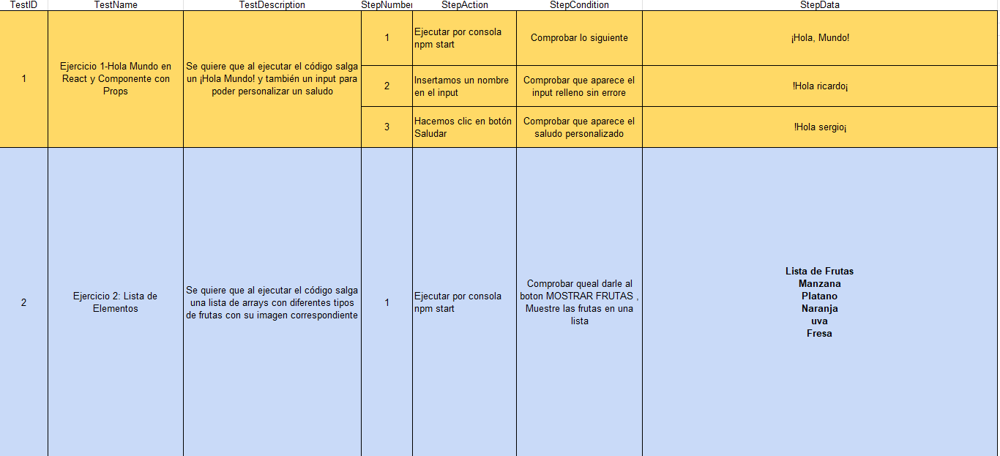

- Ejercicio 3-4
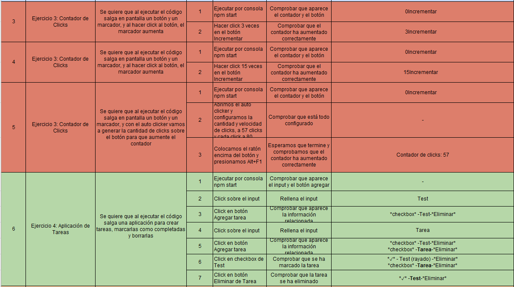
- Ejercicio 5
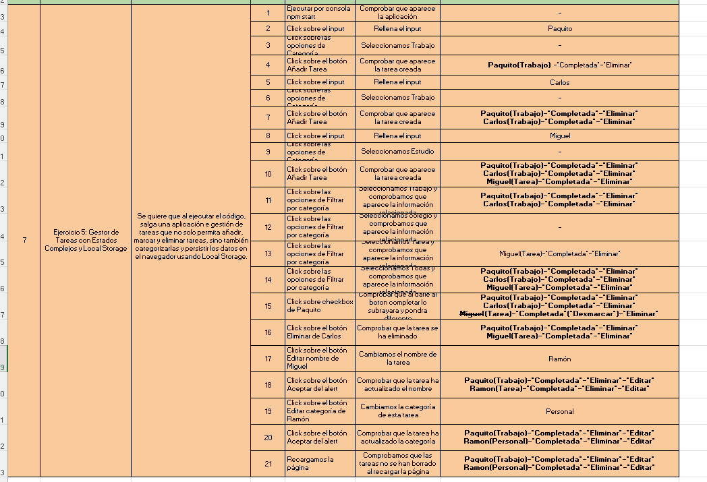

### Ejercicio 1 :
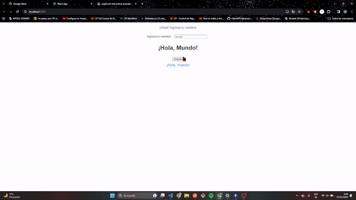
### Ejercicio 2 :
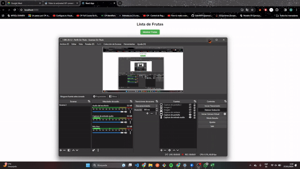

### Ejercicio 3 :
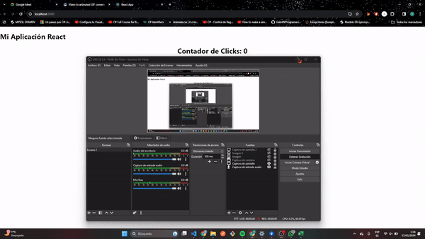
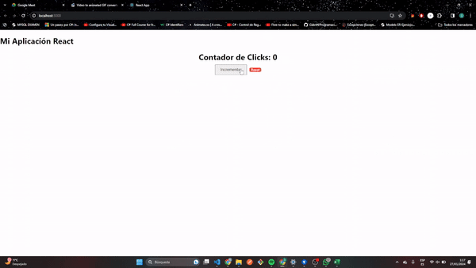
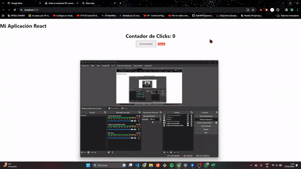

### Ejercicio 4 :

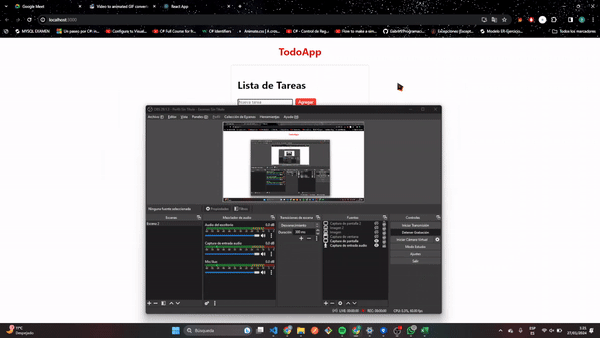

### Ejercicio 5 :
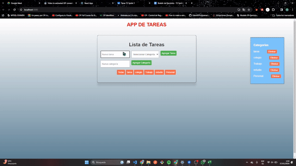
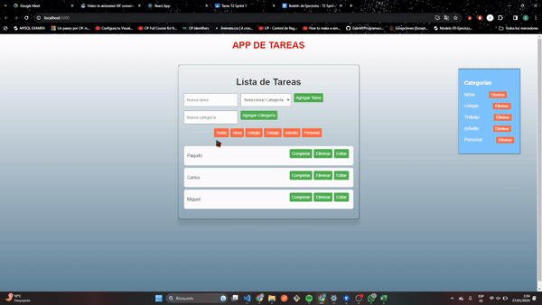