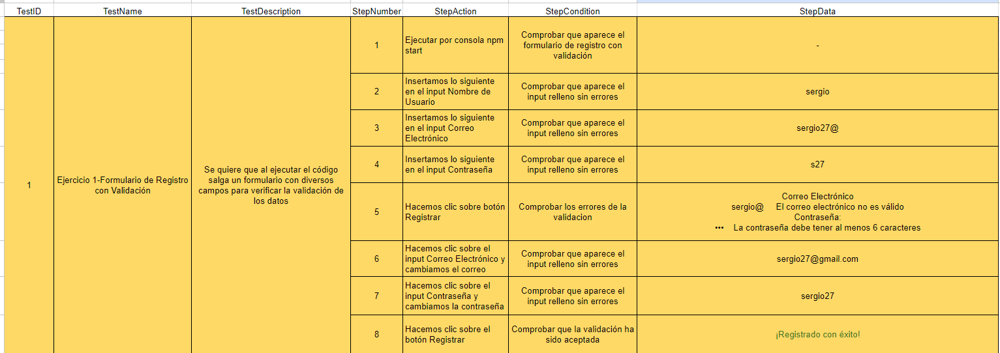
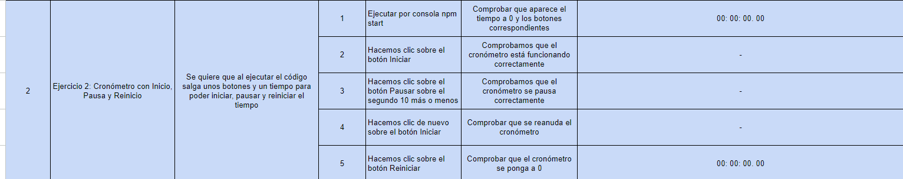
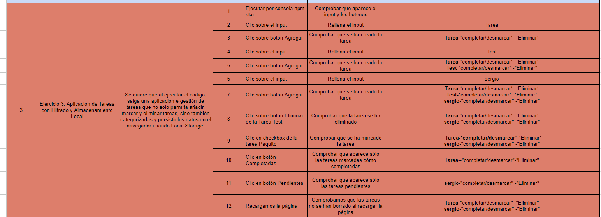
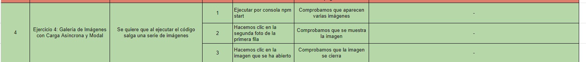
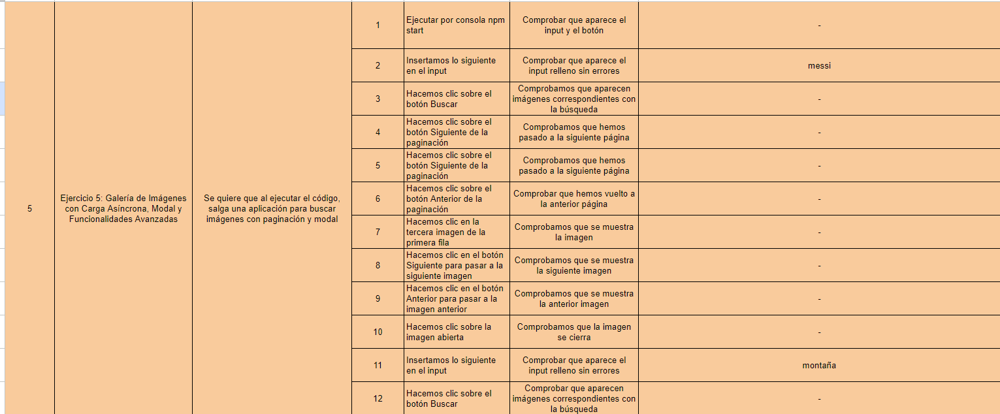
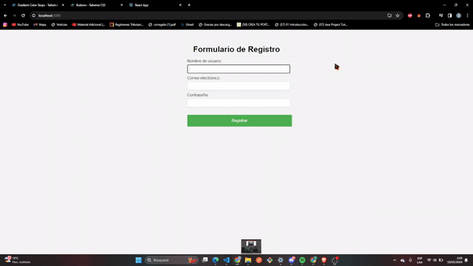
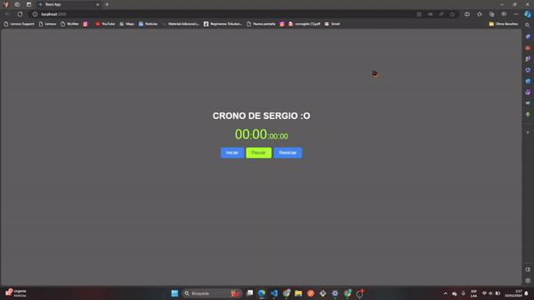
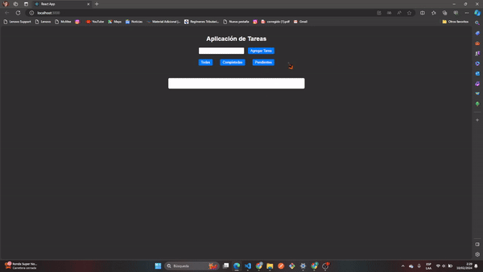

# T2 SPRINT 2 (REACT) 

 ## ANÁLISIS DEL PROBLEMA 


### Ejercicio 1: Formulario de Registro con Validación

**Objetivo: Crear un componente de clase `FormularioRegistro` que incluya campos para el nombre de usuario, correo electrónico y contraseña, con validación de cada campo**

Tareas:
- Crea un componente de clase `FormularioRegistro` con un estado que contenga valores para nombre de usuario, correo electrónico, contraseña y mensajes de error para cada campo.
- Agrega métodos para manejar los cambios en cada campo del formulario y validar los datos ingresados (por ejemplo, verificar que el correo tenga un formato válido).
- El método `render` debe mostrar un formulario con campos para el nombre de usuario, correo electrónico, contraseña y mensajes de error correspondientes.
- Implementa estilos condicionales para mostrar los campos de texto en rojo si hay un error de validación.
- Renderiza `FormularioRegistro` en `App` y prueba la validación del formulario.


#### Especificaciones   
**Prueba: Asegúrate de que el formulario valida correctamente los datos y muestra mensajes de error. Verifica que los estilos de error se aplican correctamente a los campos inválidos.**
  
## Ejercicio 2: Cronómetro con Inicio, Pausa y Reinicio

**Objetivo: Crear un componente de clase `Cronometro` que funcione como un cronómetro con botones para iniciar, pausar y reiniciar el tiempo** 
Tareas:
- Crea un componente de clase `Cronometro` con un estado que incluya el tiempo transcurrido y si el cronómetro está activo o no.
- Implementa un método para iniciar el cronómetro que use `setInterval` para actualizar el tiempo cada segundo.
- Agrega métodos para pausar y reiniciar el cronómetro, actualizando el estado según corresponda.
- El método `componentWillUnmount` debe limpiar el intervalo para evitar fugas de memoria.
- El método `render` debe mostrar el tiempo transcurrido y botones para iniciar, pausar y reiniciar el cronómetro.
- Renderiza `Cronometro` en `App` y prueba su funcionalidad.


#### Especificaciones
**Prueba: Verifica que el cronómetro inicia, pausa y se reinicia correctamente. Comprueba que al eliminar el componente del DOM, el intervalo se limpia para evitar fugas de memoria.**


## Ejercicio 3: Aplicación de Tareas con Filtrado y Almacenamiento Local
**Objetivo: Crear una aplicación de tareas (`AppTareas`) que permita añadir, eliminar, filtrar tareas y almacenarlas en el almacenamiento local del navegador. Tareas:**

- Crea un componente de clase `AppTareas` con un estado que incluya un arreglo de tareas, un campo de texto para nuevas tareas y un filtro de estado (todas, completadas, pendientes).
- Implementa funcionalidades para añadir nuevas tareas, marcarlas como completadas, eliminar tareas y filtrarlas según su estado.
- Usa `componentDidMount` para cargar las tareas almacenadas en el almacenamiento local y `componentDidUpdate` para actualizar el almacenamiento local cuando las tareas cambien.
- El método `render` debe mostrar un formulario para nuevas tareas, botones para filtrar, y una lista de tareas que refleje el filtro seleccionado.
- Renderiza `AppTareas` en `App` y prueba todas las funcionalidades.
- Crea un componente de clase `AppTareas` con un estado que incluya un arreglo de tareas, un campo de texto para nuevas tareas y un filtro de estado (todas, completadas, pendientes).
- Implementa funcionalidades para añadir nuevas tareas, marcarlas como completadas, eliminar tareas y filtrarlas según su estado.
- Usa `componentDidMount` para cargar las tareas almacenadas en el almacenamiento local y `componentDidUpdate` para actualizar el almacenamiento local cuando las tareas cambien.
- El método `render` debe mostrar un formulario para nuevas tareas, botones para filtrar, y una lista de tareas que refleje el filtro seleccionado.
- Renderiza `AppTareas` en `App` y prueba todas las funcionalidades.


#### Especificaciones
  **Prueba: Asegúrate de que la aplicación permite añadir, eliminar, filtrar y marcar tareas. Verifica que las tareas persisten al recargar la página.**
  
## Ejercicio 4: Aplicación de Tareas

  **Objetivo: Crear una galería de imágenes (`GaleriaImagenes`) que cargue imágenes de una API, las muestre en un grid y permita abrir una imagen en un modal al hacer clic. Tareas:**
  
- Crea un componente de clase `GaleriaImagenes` con un estado que incluya un arreglo de imágenes y la imagen seleccionada para el modal.
- En `componentDidMount`, realiza una petición a una API de imágenes (como Unsplash o similar) para cargar imágenes y guardarlas en el estado.
- Implementa un componente modal que se abra al hacer clic en una imagen, mostrando la imagen en tamaño completo.
- El método `render` debe mostrar un grid de imágenes y, si una imagen está seleccionada, el modal con la imagen.
- Renderiza `GaleriaImagenes` en `App` y prueba la carga de imágenes y la funcionalidad del modal.


#### Especificaciones
  **Prueba: Verifica que las imágenes se cargan correctamente desde la API y que el modal funciona al hacer clic en las imágenes. Asegúrate de que el modal se cierra adecuadamente.**


## Ejercicio 5: Galería de Imágenes con Carga Asíncrona, Modal y Funcionalidades Avanzadas

#### Descripción

  **Objetivo**: Crear una galería de imágenes avanzada (GaleriaImagenesAvanzada) que cargue imágenes de una API, las muestre en un grid, permita abrir una imagen en un modal, y ofrezca funcionalidades adicionales como búsqueda y paginación. Tareas:

**Componente de Clase GaleriaImagenesAvanzada:** Crea un componente con un estado que incluya un arreglo de imágenes, la imagen seleccionada para el modal, la página actual y términos de búsqueda.
**Carga Asíncrona de Imágenes:**
- En componentDidMount, realiza una petición a una API de imágenes (como Unsplash) para cargar imágenes y guardarlas en el estado.
- Implementa la paginación para cargar más imágenes cuando el usuario llegue al final del grid o mediante botones de navegación.
  
**Búsqueda de Imágenes:**
- Añade un campo de búsqueda para permitir a los usuarios buscar imágenes por términos específicos.
- Actualiza la galería de acuerdo a los resultados de la búsqueda.

**Componente Modal para Visualización de Imágenes:**
- Implementa un componente modal que se abra al hacer clic en una imagen, mostrando la imagen en tamaño completo.
- Añade funcionalidades al modal, como botones para navegar entre imágenes en la galería.

**Renderizado y Prueba:**
- El método render debe mostrar un campo de búsqueda, un grid de imágenes, controles de paginación y, si una imagen está seleccionada, el modal con la imagen.
- Renderiza GaleriaImagenesAvanzada en App y prueba la carga de imágenes, la funcionalidad del modal, la búsqueda y la paginación.


#### Especificaciones

- **Verifica que las imágenes se cargan correctamente desde la API y que la paginación funciona adecuadamente.**
- **Asegúrate de que la búsqueda retorna resultados relevantes y actualiza el grid de imágenes.**
- **Comprueba que el modal se abre al hacer clic en las imágenes y permite navegar entre ellas.**
- **Confirma que todas las funcionalidades se integran armoniosamente y ofrecen una experiencia de usuario fluida**


## Solucion del Problema 
## Ejercicio 1: Formulario de Registro con Validación
```javascript
/*components/formularioRegistro/index.jsx*/
import React, { Component } from 'react';

class FormularioRegistro extends Component {
  constructor(props) {
    super(props);
    this.state = {
      username: '',
      email: '',
      password: '',
      errors: {
        username: '',
        email: '',
        password: '',
      },
    };
  }

  handleInputChange = (e) => {
    const { name, value } = e.target;
    this.setState((prevState) => ({
      [name]: value,
      errors: {
        ...prevState.errors,
        [name]: '', // Resetear el error al cambiar el campo
      },
    }));
  };

  validateForm = () => {
    const { username, email, password } = this.state;
    let errors = {
      username: '',
      email: '',
      password: '',
    };
    let isValid = true;

    // Validación del nombre de usuario
    if (username.trim() === '') {
      errors.username = 'El nombre de usuario es obligatorio';
      isValid = false;
    } else if (!/^[a-zA-Z ]+$/.test(username)) {
      errors.username = 'Ingrese un nombre de usuario válido (solo letras y espacios)';
      isValid = false;
    }

    // Validación del correo electrónico
    const emailRegex = /^[^\s@]+@[^\s@]+\.[^\s@]+$/;
    if (!emailRegex.test(email)) {
      errors.email = 'Ingrese un correo electrónico válido';
      isValid = false;
    }

    // Validación de la contraseña
    if (password.length < 6) {
      errors.password = 'La contraseña debe tener al menos 6 caracteres';
      isValid = false;
    }

    this.setState({ errors });
    return isValid;
  };

  handleSubmit = (e) => {
    e.preventDefault();
    if (this.validateForm()) {
      // Aquí puedes realizar acciones adicionales, como enviar el formulario
      console.log('Formulario válido. Enviar datos al servidor.');
    } else {
      console.log('Formulario inválido. Por favor, corrige los errores.');
    }
  };

  render() {
    const { username, email, password, errors } = this.state;

    return (
      <form onSubmit={this.handleSubmit}>
        <div>
          <label>Nombre de usuario:</label>
          <input
            type="text"
            name="username"
            value={username}
            onChange={this.handleInputChange}
            style={{
              borderColor: errors.username ? 'red' : '',
              color: errors.username ? 'red' : 'black',
            }}
          />
          <span style={{ color: 'red' }}>{errors.username}</span>
        </div>

        <div>
          <label>Correo electrónico:</label>
          <input
            type="text"
            name="email"
            value={email}
            onChange={this.handleInputChange}
            style={{ borderColor: errors.email ? 'red' : '', color: errors.email ? 'red' : 'black' }}
          />
          <span style={{ color: 'red' }}>{errors.email}</span>
        </div>

        <div>
          <label>Contraseña:</label>
          <input
            type="password"
            name="password"
            value={password}
            onChange={this.handleInputChange}
            style={{
              borderColor: errors.password ? 'red' : '',
              color: errors.password ? 'red' : 'black',
            }}
          />
          <span style={{ color: 'red' }}>{errors.password}</span>
        </div>

        <button type="submit">Registrar</button>
      </form>
    );
  }
}

export default FormularioRegistro;
```
```javascript
/*App.jsx*/
import React from 'react';
import FormularioRegistro from '../components/formularioRegistro/index.jsx';
import '../index.css';

function App() {
  return (
    <div>
      <h1>Formulario de Registro</h1>
      <FormularioRegistro />
    </div>
  );
}

export default App;
```
## Ejercicio 2: Cronómetro con Inicio, Pausa y Reinicio
```javascript
// Cronometro.js
import React, { Component } from 'react';

class Cronometro extends Component {
  constructor(props) {
    super(props);
    this.state = {
      tiempo: props.tiempo || 0,
      activo: false,
    };
    this.intervalId = null;
  }

  iniciarCronometro = () => {
    if (!this.state.activo) {
      this.setState({ activo: true });
      this.intervalId = setInterval(() => {
        this.setState((prevState) => ({
          tiempo: prevState.tiempo + 10,
        }));
      }, 10);
    }
  };

  pausarCronometro = () => {
    if (this.state.activo) {
      clearInterval(this.intervalId);
      this.setState({ activo: false });
    }
  };

  reiniciarCronometro = () => {
    clearInterval(this.intervalId);
    this.setState({
      tiempo: 0,
      activo: false,
    });
  };

  componentWillUnmount() {
    clearInterval(this.intervalId);
  }

  render() {
    const { tiempo, activo } = this.state;

    const milisegundos = String(tiempo % 1000).slice(0, 2);
    const segundos = Math.floor((tiempo / 1000) % 60);
    const minutos = Math.floor((tiempo / (1000 * 60)) % 60);
    const horas = Math.floor(tiempo / (1000 * 60 * 60));

    return (
      <div className="cronometro-container">
        <div className="tiempo">
          <span className="grande">{String(horas).padStart(2, '0')}</span>:
          <span className="grande">{String(minutos).padStart(2, '0')}</span>:
          <span className="pequeno">{String(segundos).padStart(2, '0')}</span>:
          <span className="pequeno">{String(milisegundos).padStart(2, '0')}</span>
        </div>
        <div className="botones">
          <button onClick={this.iniciarCronometro} disabled={activo}>
            Iniciar
          </button>
          <button onClick={this.pausarCronometro} disabled={!activo}>
            Pausar
          </button>
          <button onClick={this.reiniciarCronometro}>Reiniciar</button>
        </div>
      </div>
    );
  }
}

export default Cronometro;


/*app.jsx*/
import React from 'react';
import Cronometro from './cronometro/index.jsx';
import '../index.css';

function App() {
  return (
    <div>
      <h1>CRONO DE SERGIO :O</h1>
      <Cronometro />
    </div>
  );
}

export default App;
```

## Ejercicio 3: Aplicación de Tareas con Filtrado y Almacenamiento Local
```javascript
import React, { Component } from 'react';
class AppTareas extends Component {
  constructor(props) {
    super(props);
    this.state = {
      tareas: [],
      nuevaTarea: '',
      filtro: 'todas', // Opciones: 'todas', 'completadas', 'pendientes'
    };
  }

  componentDidMount() {
    const storedTareas = JSON.parse(localStorage.getItem('tareas')) || [];
    this.setState({ tareas: storedTareas });
  }

  componentDidUpdate(prevProps, prevState) {
    if (prevState.tareas !== this.state.tareas) {
      localStorage.setItem('tareas', JSON.stringify(this.state.tareas));
    }
  }

  agregarTarea = () => {
    const { nuevaTarea } = this.state;
    if (nuevaTarea.trim() !== '') {
      this.setState((prevState) => ({
        tareas: [...prevState.tareas, { texto: nuevaTarea, completada: false }],
        nuevaTarea: '',
      }));
    }
  };

  eliminarTarea = (index) => {
    this.setState((prevState) => ({
      tareas: prevState.tareas.filter((_, i) => i !== index),
    }));
  };

  toggleCompletada = (index) => {
    this.setState((prevState) => ({
      tareas: prevState.tareas.map((t, i) =>
        i === index ? { ...t, completada: !t.completada } : t
      ),
    }));
  };

  handleFiltro = (filtro) => {
    this.setState({ filtro });
  };

  render() {
    const { tareas, nuevaTarea, filtro } = this.state;

    const tareasFiltradas =
      filtro === 'completadas'
        ? tareas.filter((tarea) => tarea.completada)
        : filtro === 'pendientes'
        ? tareas.filter((tarea) => !tarea.completada)
        : tareas;

    return (
      <div className="container">
        <h1>Aplicación de Tareas</h1>
        <form onSubmit={(e) => e.preventDefault()}>
          <input
            type="text"
            value={nuevaTarea}
            onChange={(e) => this.setState({ nuevaTarea: e.target.value })}
          />
          <button type="button" onClick={this.agregarTarea}>
            Agregar Tarea
          </button>
        </form>

        <div className="filter-container">
          <div className="filter-buttons">
            <button
              className={filtro === 'todas' ? 'active' : ''}
              onClick={() => this.handleFiltro('todas')}
            >
              Todas
            </button>
            <button
              className={filtro === 'completadas' ? 'active' : ''}
              onClick={() => this.handleFiltro('completadas')}
            >
              Completadas
            </button>
            <button
              className={filtro === 'pendientes' ? 'active' : ''}
              onClick={() => this.handleFiltro('pendientes')}
            >
              Pendientes
            </button>
          </div>
        </div>

        <ul>
          {tareasFiltradas.map((tarea, index) => (
            <li key={index}>
              <span
                onClick={() => this.toggleCompletada(index)}
                className={tarea.completada ? 'completed' : ''}
              >
                {tarea.texto}
              </span>
              <div>
                <button
                  className={tarea.completada ? 'desmarcar' : 'completar'}
                  onClick={() => this.toggleCompletada(index)}
                >
                </button>
                <button onClick={() => this.eliminarTarea(index)}>Eliminar</button>
              </div>
            </li>
          ))}
        </ul>
      </div>
    );
  }
}

export default AppTareas;

/*app.jsx*/
import React from 'react';
import '../index.css';
import AppTareas from '../components/apptareas/index.jsx';

function App() {
  return (
    <div>
      <AppTareas />
    </div>
  );
}

export default App;

```
## Ejercicio 4: Galería de Imágenes con Carga Asíncrona y Modal
```javascript
/*Components/GaleriaImagenes/index.jsx*/
import React, { Component } from 'react';
import Modal from '../modal/index.jsx';
import '../../index.css';

class GaleriaImagenes extends Component {
  constructor(props) {
    super(props);
    this.state = {
      imagenes: [],
      imagenSeleccionada: null,
      indexImagenActual: 0, // Agregamos indexImagenActual al estado
    };
    this.ballsContainerRef = React.createRef();
  }

  componentDidMount() {
    const WIDTH = 400; // Ancho de la imagen
    const HEIGHT = 300; // Alto de la imagen
    const COUNT = 10; // Cantidad de imágenes que deseas obtener

    fetch(`https://picsum.photos/v2/list?page=15&limit=${COUNT}`)
      .then((response) => response.json())
      .then((data) =>
        this.setState({
          imagenes: data.map((img) => ({
            ...img,
            url: `${img.download_url}/${WIDTH}/${HEIGHT}`,
          })),
        })
      );

    this.initBallsAnimation();
  }

  initBallsAnimation() {
    const colors = ['#3CC157', '#2AA7FF', '#1B1B1B', '#FCBC0F', '#F85F36'];
    const numBalls = 50;

    for (let i = 0; i < numBalls; i++) {
      let ball = document.createElement('div');
      ball.classList.add('ball');
      ball.style.background = colors[Math.floor(Math.random() * colors.length)];
      ball.style.left = `${Math.floor(Math.random() * 100)}vw`;
      ball.style.top = `${Math.floor(Math.random() * 100)}vh`;
      ball.style.transform = `scale(${Math.random()})`;
      ball.style.width = `${Math.random()}em`;
      ball.style.height = ball.style.width;

      this.ballsContainerRef.current.appendChild(ball);
    }

    // Keyframes
    this.ballsContainerRef.current.querySelectorAll('.ball').forEach((el, i, ra) => {
      let to = {
        x: Math.random() * (i % 2 === 0 ? -11 : 11),
        y: Math.random() * 12,
      };

      let anim = el.animate(
        [
          { transform: 'translate(0, 0)' },
          { transform: `translate(${to.x}rem, ${to.y}rem)` },
        ],
        {
          duration: (Math.random() + 1) * 2000, // random duration
          direction: 'alternate',
          fill: 'both',
          iterations: Infinity,
          easing: 'ease-in-out',
        }
      );
    });
  }

  abrirModal = (imagen) => {
    this.setState({ imagenSeleccionada: imagen });
  };

  cerrarModal = () => {
    this.setState({ imagenSeleccionada: null });
  };

  avanzarImagen = () => {
    const { indexImagenActual, imagenes } = this.state;
    const newIndex = (indexImagenActual + 1) % imagenes.length;
    this.setState({ indexImagenActual: newIndex, imagenSeleccionada: imagenes[newIndex] });
  };

  retrocederImagen = () => {
    const { indexImagenActual, imagenes } = this.state;
    const newIndex = indexImagenActual === 0 ? imagenes.length - 1 : indexImagenActual - 1;
    this.setState({ indexImagenActual: newIndex, imagenSeleccionada: imagenes[newIndex] });
  };

  render() {
    const { imagenes, imagenSeleccionada } = this.state;

    return (
      <div>
        <div ref={this.ballsContainerRef} id="balls-container" />
        <div className="galeria">
          {imagenes.map((imagen, index) => (
             this.abrirModal(imagen)}
              className="imagen"
            />
          ))}

          {imagenSeleccionada && (
            <Modal
              imagen={imagenSeleccionada}
              cerrarModal={this.cerrarModal}
              />
              )}
        </div>
      </div>
    );
  }
}

export default GaleriaImagenes;


/*modal/index.jsx*/
import React from 'react';

const Modal = ({ imagen, cerrarModal }) => {
  return (
    <div className="modal">
      <div className="modal-contenido">
        <span className="cerrar" onClick={cerrarModal}>&times;</span>
        
      </div>
    </div>
  );
};

export default Modal;

/*app.jsx*/

import React from 'react';
import '../index.css';
import GaleriaImagenes from '../components/GaleriaImagenes';

function App() {
  return (
    <div>
      <h1> Galeria de Imagenes </h1>
      <GaleriaImagenes />
    </div>
  );
}

export default App;

```

## Ejercicio 5: Galería de Imágenes con Carga Asíncrona, Modal y Funcionalidades Avanzadas

```javascript
/*Components/GaleriaImagenes/index.jsx*/
import React, { Component } from 'react';
import '../../index.css';
import Modal from '../modal/index.jsx';


class GaleriaImagenesAvanzada extends Component {
  constructor(props) {
    super(props);
    this.state = {
      images: [],
      selectedImage: null,
      page: 1,
      perPage: 10,
      totalPages: 20,
      searchTerm: '',
      isLoading: false,
      error: '',
      searchBarTop: false,
      showTitle: true,
      showGift: true
    };
    this.accessKey = 'zpxbjY7wY2TTFPDyOYfD6eKLgrKoCYsxyIoi94nAxCs'; // Access Key inicialmente vacío
  }

  componentDidMount() {
    // Solicitar Access Key cuando el componente se monta
    this.requestAccessKey();
    window.addEventListener('scroll', this.handleScroll);
  }

  componentWillUnmount() {
    window.removeEventListener('scroll', this.handleScroll);
  }

  // Método para solicitar el Access Key al usuario
  requestAccessKey = () => {
    const accessKey = prompt('Por favor, introduce tu Access Key de Unsplash:');
    if (accessKey) {
      this.accessKey = accessKey || this.accessKey;
      this.loadImages(); // Cargar imágenes una vez que se obtiene el Access Key
    }
  };

  loadImages = async () => {
    const { page, perPage, searchTerm } = this.state;
    this.setState({ isLoading: true, error: '' });

    try {
        const response = await fetch(
            `https://api.unsplash.com/search/photos?page=${page}&per_page=${perPage}&query=${searchTerm}`,
            {
                headers: {
                    Authorization: `Client-ID ${this.accessKey}`
                }
            }
        );
        const data = await response.json();
        this.setState({
            images: data.results, // Usamos data.results para obtener solo las imágenes de la respuesta
            totalPages: response.headers.get('X-Total-Pages'), // Actualizamos el total de páginas
            isLoading: false,
            showTitle: false, // Ocultar el título
            showGift: false // Ocultar la imagen de regalo
        });
    } catch (error) {
        console.error('Error fetching images:', error);
        this.setState({ isLoading: false, error: 'Error al cargar las imágenes. Por favor, intenta nuevamente.' });
    }
};

  handleNextPage = () => {
    this.setState({ page: this.state.page + 1 }, this.loadImages);
  };
  
  handlePreviousPage = () => {
    this.setState({ page: this.state.page - 1 }, this.loadImages);
  };

  handleSearchChange = (event) => {
    this.setState({ searchTerm: event.target.value });
  };

  handleSearchSubmit = () => {
    this.setState({ images: [], page: 1, searchBarTop: true }, this.loadImages);
  };

  handleImageClick = (image) => {
    this.setState({ selectedImage: image });
  };

  handleCloseModal = () => {
    this.setState({ selectedImage: null });
  };

  render() {
    const { images, selectedImage, searchTerm, isLoading, error, page, totalPages, searchBarTop,showTitle, showGift } = this.state;
    
    return (
      <div>
      {showTitle && <h1>Galería de imágenes avanzada</h1>}
      {showGift && (
        <div className="gift">
          
        </div>
      )}
        <div className={`search-bar ${searchBarTop ? 'search-bar-top' : 'search-bar-center'}`}> 
          <input
            type="text"
            placeholder="Buscar imágenes y colecciones"
            value={searchTerm}
            onChange={this.handleSearchChange}
          />
          <button onClick={this.handleSearchSubmit}>Buscar</button>
        </div>
        {error && <div>Error: {error}</div>}
        <div className="album">
          {images.map((image) => (
             this.handleImageClick(image)}
            />
          ))}
        </div>
        {isLoading && <div className="loading">Cargando...</div>}
        {selectedImage && (
          <Modal
            images={images}
            selectedImage={selectedImage}
            onClose={this.handleCloseModal}
          />
        )}
        <div className="pagination-buttons">
          <button onClick={this.handlePreviousPage} disabled={page === 1}>Anterior</button>
          <button onClick={this.handleNextPage} disabled={page === totalPages}>Siguiente</button>
        </div>
      </div>
    );
  }
}

export default GaleriaImagenesAvanzada;

/*modal/index.jsx*/
import React, { Component } from 'react';
import './modal.css';

class Modal extends Component {
  constructor(props) {
    super(props);
    this.state = {
      currentIndex: this.props.images.findIndex((image) => image.id === this.props.selectedImage.id)
    };
  }

  handlePrevClick = () => {
    const { currentIndex } = this.state;
    if (currentIndex > 0) {
      this.setState({ currentIndex: currentIndex - 1 });
    }
  };

  handleNextClick = () => {
    const { currentIndex } = this.state;
    const { images } = this.props;
    if (currentIndex < images.length - 1) {
      this.setState({ currentIndex: currentIndex + 1 });
    }
  };

  render() {
    const { images, onClose } = this.props;
    const { currentIndex } = this.state;
    const currentImage = images[currentIndex];

    return (
      <div className="modal-overlay" onClick={onClose}>
        <div className="modal-content" onClick={(e) => e.stopPropagation()}>
          <button className="close-button" onClick={onClose}>Cerrar</button>
          
          <div className="navigation-buttons">
            <button onClick={this.handlePrevClick} disabled={currentIndex === 0}>Anterior</button>
            <button onClick={this.handleNextClick} disabled={currentIndex === images.length - 1}>Siguiente</button>
          </div>
        </div>
      </div>
    );
  }
}

export default Modal;


/*app.jsx*/
import React from 'react';
import GaleriaImagenesAvanzada from '../components/GaleriaImagenes/index.jsx';

function App() {

  return (
    <div className="App">
      <GaleriaImagenesAvanzada />
    </div>
  );
}

export default App;
```

## Pruebas 
### -> Plan de Pruebas :

- Ejercicio 1


- Ejercicio 2

- Ejercicio 3

- Ejercicio 4

- Ejercicio 5

p
### Ejercicio 1 :

### Ejercicio 2 :


### Ejercicio 3 :


### Ejercicio 4 :


### Ejercicio 5 :
