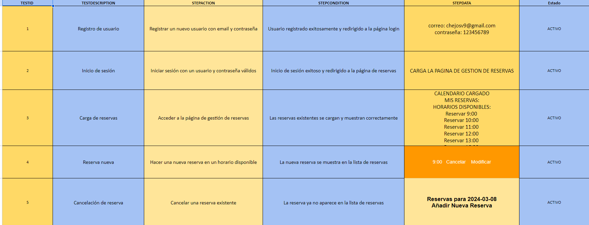
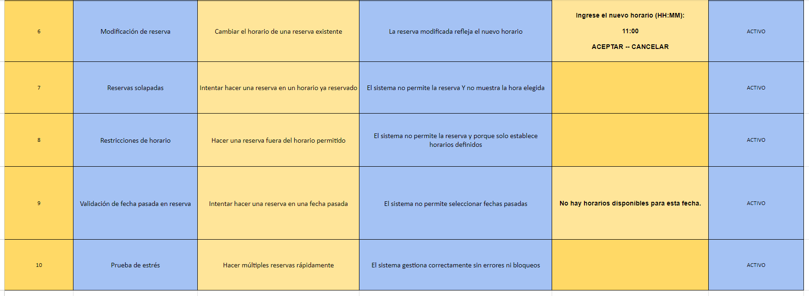
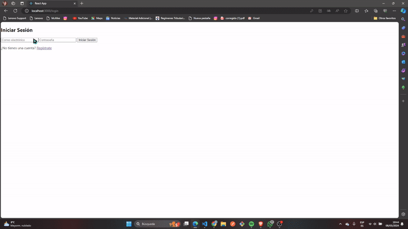

# T2 SPRINT 4 (REACT) 

 ## ANÁLISIS DEL PROBLEMA 

En el contexto de un sistema de reservas online, los usuarios registrados necesitan una interfaz clara e interactiva para realizar y administrar sus reservas. El problema se centra en cómo proporcionar una experiencia de usuario eficiente y amigable que permita a los usuarios:

- Ver un calendario con los días y horarios disponibles.
- Realizar nuevas reservas en horarios disponibles.
- Modificar o cancelar sus reservas existentes.
- Evitar solapamientos de horarios y respetar las restricciones impuestas por el centro de reservas.

El sistema debe ser autocontenido, sin ambigüedades y fácilmente accesible para los usuarios finales.

## Diseño de la Propuesta de Solución del Problema

La solución propuesta para el problema involucra el desarrollo de un componente `GestionReservas` en React que contendrá:

- Un estado para administrar las reservas de los usuarios, la disponibilidad del calendario y los horarios disponibles.
- Un calendario interactivo que refleje las fechas y horarios donde los usuarios pueden realizar reservas.
- Funciones para:
  - Agregar una nueva reserva.
  - Modificar una reserva existente.
  - Cancelar una reserva.
- La lógica para asegurar que las reservas no se solapen y estén dentro de las restricciones de horario del centro.

La interfaz debe incluir:

- Visualización del calendario.
- Selección interactiva de fechas y horarios.
- Gestión visual y funcional de las reservas del usuario.

Se utilizarán herramientas de diseño como diagramas UML o diagramas de flujo para planificar la arquitectura del componente y sus interacciones.

## Implementación del Diseño Propuesto

La implementación se llevará a cabo respetando la siguiente estructura de directorios y archivos, asegurando que cada componente tenga su propio espacio y hoja de estilos para una mejor organización y mantenimiento del código:

- `src/`
  - `Components/`
    - `GestionReservas/`
      - `GestionReservas.jsx`: Componente principal para la gestión de reservas.
      - `GestionReservas.css`: Hoja de estilos específica para el componente de gestión de reservas.
    - `Login/`
      - `Login.jsx`: Componente para facilitar el inicio de sesión de los usuarios.
      - `Login.css`: Hoja de estilos para la página de inicio de sesión.
    - `Registro/`
      - `Registro.jsx`: Componente que permite a los nuevos usuarios registrarse en el sistema.
      - `Registro.css`: Hoja de estilos para la página de registro.
  - `App.jsx`: Archivo principal de la aplicación que renderiza los componentes principales según el estado de la sesión del usuario.
  - `App.css`: Hoja de estilos global de la aplicación.
  - `index.jsx`: Punto de entrada de la aplicación React.
  - `firebase/`
    - `firebase.js`: Configuración y utilidades de Firebase, incluyendo la inicialización de Firestore.

Además de la estructura principal de componentes, se incorporarán las siguientes configuraciones y archivos de utilidades:

- `authContext/`
  - `AuthContext.jsx`: Contexto de React para administrar el estado global de autenticación de los usuarios.
- `firebase/`
  - `auth.js`: Funciones de utilidad para manejar la autenticación con Firebase.
  - `firebase.js`: Configuración inicial de Firebase y exportación de la instancia de Firestore.

## Pruebas de la Resolución del Problema

Se realizarán pruebas para verificar que:

- Los usuarios pueden realizar una reserva sin problemas en horarios disponibles.
- Las reservas existentes pueden ser modificadas y canceladas adecuadamente.
- El sistema administra correctamente los horarios disponibles, previniendo solapamientos y respetando las restricciones.
- La experiencia del usuario al interactuar con el calendario es fluida e intuitiva.

Estas pruebas se llevarán a cabo tanto de manera programática usando tests automatizados como a través de pruebas manuales y de usuario.

## Solucion del Problema 

Aquí se muestra el código principal de la aplicación (`App.jsx`):

```jsx
import React from 'react';
import { BrowserRouter as Router, Routes, Route } from 'react-router-dom';
import { AuthProvider } from './authContext/index.jsx';
import GestionReservas from './Components/GestionDeReservas/index.jsx';
import Login from './Components/login/index.jsx';
import Register from './Components/Registro/index.jsx';

function App() {
  return (
    <AuthProvider>
      <Router>
        <Routes>
          <Route path="/" element={<Login />} />
          <Route path="/login" element={<Login />} />
          <Route path="/register" element={<Register />} />
          <Route path="/reservas" element={<GestionReservas />} />
        </Routes>
      </Router>
    </AuthProvider>
  );
}

export default App;

```
Aquí se muestra el código principal de la aplicación (`Components/GestionDeReservas/index.jsx`):

```jsx
import React, { useState, useEffect } from 'react';
import Calendar from 'react-calendar';
import 'react-calendar/dist/Calendar.css';
import './GestionReservas.css';
import { db } from '../../firebase/firebase.js'; // Verifica la ruta
import { collection, doc, addDoc, deleteDoc, updateDoc, query, where, getDocs } from 'firebase/firestore';

function GestionReservas() {
  const [selectedDate, setSelectedDate] = useState(new Date());
  const [reservas, setReservas] = useState([]);
  const [cargando, setCargando] = useState(false);
  const [error, setError] = useState(null);

  const horariosDisponibles = ['9:00', '10:00', '11:00', '12:00', '13:00', '16:00', '17:00', '18:00', '19:00', '20:00'];

  useEffect(() => {
    cargarReservas(formatDate(selectedDate));
  }, [selectedDate]);

  const cargarReservas = async (fecha) => {
    setCargando(true);
    try {
      const q = query(collection(db, "reservas"), where("fecha", "==", fecha));
      const querySnapshot = await getDocs(q);
      const reservasCargadas = querySnapshot.docs.map(doc => ({ id: doc.id, ...doc.data() }));
      setReservas(reservasCargadas);
    } catch (err) {
      setError(err);
    } finally {
      setCargando(false);
    }
  };

  const hacerReserva = async (horario) => {
    setCargando(true);
    try {
      await addDoc(collection(db, "reservas"), {
        fecha: formatDate(selectedDate),
        horario
      });
      cargarReservas(formatDate(selectedDate));
    } catch (err) {
      setError(err);
    } finally {
      setCargando(false);
    }
  };

  const cancelarReserva = async (idReserva) => {
    setCargando(true);
    try {
      await deleteDoc(doc(db, "reservas", idReserva));
      cargarReservas(formatDate(selectedDate));
    } catch (err) {
      setError(err);
    } finally {
      setCargando(false);
    }
  };

  const modificarReserva = async (idReserva, nuevoHorario) => {
    setCargando(true);
    try {
      await updateDoc(doc(db, "reservas", idReserva), {
        horario: nuevoHorario
      });
      cargarReservas(formatDate(selectedDate));
    } catch (err) {
      setError(err);
    } finally {
      setCargando(false);
    }
  };

  const handleDateChange = (date) => {
    setSelectedDate(date);
  };

  const formatDate = (date) => {
    const year = date.getFullYear();
    const month = (date.getMonth() + 1).toString().padStart(2, '0');
    const day = date.getDate().toString().padStart(2, '0');
    return `${year}-${month}-${day}`;
  };

  // Filtra los horarios disponibles para quitar los ya reservados
  const horariosDisponiblesParaFecha = horariosDisponibles.filter(horario => 
    !reservas.some(reserva => reserva.horario === horario));
  // El resto del código de UI sigue igual
// Asumiendo que has implementado las funciones y estados previamente descritos
return (
  <div className="gestion-reservas">
    <h2>Calendario de Reservas</h2>
    <div className="calendar-container">
      <Calendar
        onChange={handleDateChange}
        value={selectedDate}
        minDate={new Date()}
      />
    </div>
    <div className="reservas-container">
      {cargando ? (
        <p>Cargando reservas...</p>
      ) : error ? (
        <p>Error al cargar reservas: {error.message}</p>
      ) : (
        <>
          <h3>Reservas para {formatDate(selectedDate)}</h3>
          <ul className="reservas-lista">
            {reservas.map(({ id, horario }) => (
              <li key={id} className="reserva-item">
                {horario}
                <button onClick={() => cancelarReserva(id)} className="btn btn-cancelar">Cancelar</button>
                <button onClick={() => {
                  const nuevoHorario = prompt("Ingrese el nuevo horario (HH:MM)", horario);
                  if (nuevoHorario) modificarReserva(id, nuevoHorario);
                }} className="btn btn-modificar">Modificar</button>
              </li>
            ))}
          </ul>
          <h4>Añadir Nueva Reserva</h4>
          <div className="horarios-disponibles">
            {horariosDisponiblesParaFecha.length > 0 ? (
              horariosDisponiblesParaFecha.map((horario) => (
                <button key={horario} onClick={() => hacerReserva(horario)} className="btn btn-reservar">
                  Reservar {horario}
                </button>
              ))
            ) : (
              <p>No hay horarios disponibles para esta fecha.</p>
            )}
          </div>
        </>
      )}
    </div>
  </div>
);
}

export default GestionReservas;

```
Aquí se muestra el código principal de la aplicación (`Components/login/index.jsx`):

```jsx
import React, { useState } from 'react';
import { Link, useNavigate } from 'react-router-dom';
import { doSignInWithEmailAndPassword } from '../../firebase/auth.js'; // Importar la función de inicio de sesión desde firebase.js

const Login = () => {
    const navigate = useNavigate();
    const [email, setEmail] = useState("");
    const [password, setPassword] = useState("");
    const [error, setError] = useState(null);

    const handleSubmit = async (e) => {
        e.preventDefault();
        try {
            await doSignInWithEmailAndPassword(email, password);
            navigate("/reservas"); // Redirigir al usuario a la página principal después del inicio de sesión exitoso
        } catch (error) {
            setError(error.message); // Mostrar el mensaje de error si ocurre algún problema durante el inicio de sesión
        }
    };

    return (
        <div>
            <div>
                <h2>Iniciar Sesión</h2>
                <form onSubmit={handleSubmit}>
                    <input
                        type="email"
                        placeholder="Correo electrónico"
                        value={email}
                        onChange={(e) => setEmail(e.target.value)}
                    />
                    <input
                        type="password"
                        placeholder="Contraseña"
                        value={password}
                        onChange={(e) => setPassword(e.target.value)}
                    />
                    {error && <p>{error}</p>} {/* Mostrar el mensaje de error si existe */}
                    <button type="submit">Iniciar Sesión</button> {/* Cambiar el evento onClick por onSubmit */}
                    <p className="mt-2 text-center text-sm text-gray-600">
                        ¿No tienes una cuenta? <Link to="/register" className="font-medium text-blue-600 hover:text-blue-500">Regístrate</Link>
                    </p>
                </form>
            </div>
        </div>
    );
}

export default Login;


```

Aquí se muestra el código principal de la aplicación (`Components/Registro/index.jsx`):

```jsx
import React, { useState } from "react";
import { useNavigate } from "react-router-dom";
import { doCreateUserWithEmailAndPassword } from "../../firebase/auth.js";

const Register = () => {
  const navigate = useNavigate();
  const [email, setEmail] = useState("");
  const [password, setPassword] = useState("");
  const [error, setError] = useState(null);
  const [successMessage, setSuccessMessage] = useState(null);
  const [isSubmitting, setIsSubmitting] = useState(false);

  const handleSubmit = async (e) => {
    e.preventDefault();
    setIsSubmitting(true);
    try {
      // Llamamos a la función doCreateUserWithEmailAndPassword con los datos del formulario
      await doCreateUserWithEmailAndPassword(email, password);
      // Si el registro es exitoso, mostramos un mensaje de éxito
      setSuccessMessage("Usuario registrado exitosamente");
      // Redirigimos al usuario a la página de inicio de sesión
      navigate("/login");
    } catch (error) {
      // Si ocurre un error durante el registro, lo manejamos mostrándolo al usuario
      setError(error.message);
    } finally {
      setIsSubmitting(false);
    }
  };

  return (
    <div>
      <h2>Registro</h2>
      <form onSubmit={handleSubmit}>
        <div>
          <label>Email:</label>
          <input
            type="email"
            value={email}
            onChange={(e) => setEmail(e.target.value)}
            required
          />
        </div>
        <div>
          <label>Contraseña:</label>
          <input
            type="password"
            value={password}
            onChange={(e) => setPassword(e.target.value)}
            required
          />
        </div>
        {error && <p>{error}</p>}
        {successMessage && <p>{successMessage}</p>}
        <button type="submit" disabled={isSubmitting}>
          Registrarse
        </button>
      </form>
    </div>
  );
};

export default Register;

```

## Pruebas 
### -> Plan de Pruebas :

- Gestion de reserva



### Gestion de reserva:
